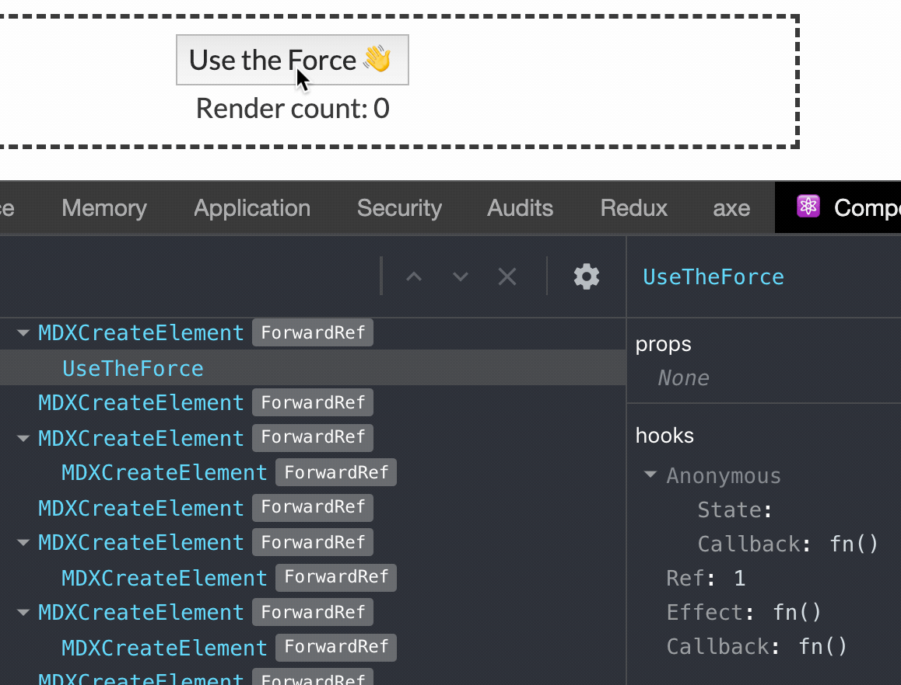

import BadExample from "./components/BadExample";
import UseTheForce from "./components/UseTheForce";

Y'all wanna see something wild? 🦒👀

---

## A little known method

There is a method in the React component class API that is fairly unknown and rarely used: [forceUpdate()](https://reactjs.org/docs/react-component.html#forceupdate).
As the React docs state,

> By default, when your component’s state or props change, your component will re-render.
> If your `render()` method depends on some other data, you can tell React that the component needs re-rendering by calling `forceUpdate()`

In a normal React application, changes to `props`, `state`, and even `context` is the main driver of component render cycles.
However, you **_can_** tell React to re-render your component without updating any of those things.
And one special way to do that is to call `forceUpdate()`.

Let's take a glance at what this may look like:

```jsx
class BadExample extends React.Component {
  callJGWentworth = () => {
    // call J.G. Wentworth, or just tell React we need it now 👇
    this.forceUpdate()
  }
  render() {
    console.log("877-CASH-NOW!!!")

    return (
      <>
        <h2>I have a structured settlement</h2>
        <button type="button" onClick={this.callJGWentworth}>
          AND I NEED CASH NOW
        </button>
      </>
    )
  }
}
```

<figcaption>
  React component forceUpdate() example usage
</figcaption>

Yeah, I know the code is bad, but it's only ~~a reflection of my daily code production~~ _an example_.
**_It actually doesn't do anything._** <small><em><strong>kinda</strong></em></small>


<figcaption>
  Be a lot cooler if it did
</figcaption>

Here's what running the above code looks like:

<BadExample />
<br />

<figcaption>
  🎶 877-CASH-NOW!!! 🎶
</figcaption>

One thing to be aware of is that `forceUpdate()` will skip `shouldComponentUpdate()` (which by default just [returns true](https://github.com/facebook/react/blob/1022ee0ec140b8fce47c43ec57ee4a9f80f42eca/packages/react-reconciler/src/ReactFiberClassComponent.js#L292)).

Going back to the React docs:

> Calling `forceUpdate()` will cause `render()` to be called on the component, skipping `shouldComponentUpdate()`.
> This will trigger the normal lifecycle methods for child components, including the `shouldComponentUpdate()` method of each child.
> **React will still only update the DOM if the markup changes.**

That last sentence simply means that calling `forceUpdate()` could end up being a `no-op` function, e.g. `() => {}`.
If nothing in the DOM will change by forcing a re-render, then you've done some wasted work on the UI thread.
[And we don't want that.](https://dassur.ma/things/when-workers/)

**_Use_** `forceUpdate()` **_sparingly and with intention._**

---

## forceUpdate(), the React hooks hway

If you've used React [hooks](https://reactjs.org/docs/hooks-intro.html), you've probably noticed that:

1. They're awesome 😎
2. They don't have a hook corollary to [componentDidCatch](https://reactjs.org/docs/react-component.html#componentdidcatch) or forceUpdate() (_hey, what gives??_)

Alright, well maybe you **_haven't_** noticed point #2.
That's _alright, alright, alright_.

It may not exist as a first class hook, but that can't stop us!
Let's write a custom hook!

```jsx
function useForceUpdate() {
  const [, forceUpdate] = React.useState()

  return React.useCallback(() => {
    forceUpdate((s) => !s)
  }, [])
}
```

<figcaption>
  forceUpdate(), but as a hook: useForceUpdate()
</figcaption>

### So, what does this hook do?

Well, it first calls `React.useState()` and passes nothing, or `undefined`, to the initial state.
Notice however, that it doesn't care about the first argument returned in the `useState()` tuple, which is the **_state variable_**.
We will soon see that this is okay though, because our initial state is `falsey`, which is just a funny way of saying that it evaluates to `false`.
It's important to note that we've effectively made the state variable **_private_** to the custom hook, or **_hidden_** to the outside users.
The state variable still exists, but _we just don't expose it for use_.
Here's what happens in [React DevTools](https://github.com/facebook/react/tree/master/packages/react-devtools-extensions#installation):



<figcaption>
  useForceUpdate() in React DevTools ⚛️
</figcaption>

The last thing that the `useForceUpdate` hook does is return a memoized callback that simply toggles the unnamed state variable.
Just like in the React class component method [setState](https://reactjs.org/docs/react-component.html#setstate), you can pass an _updater function_ to the `React.useState()` setter, as I've done here.
This updater function just happens to return the inverse of what the unnamed state variable currently is, e.g. `false` ➡️ `true`.

If you're unsure about what I mean by **_"memoized callback"_**, that's okay.
In this case, we just want the function `() => { forceUpdate(); }` to always refer to the same underlying object reference.
So, we're caching, or remembering, what the function is, even across separate calls to `useForceUpdate`.
If you're curious for more info on memoization, check out this [Wikipedia article](https://en.wikipedia.org/wiki/Memoization).

To answer the question **_"What does this hook do?"_**, it allows you to force a re-render in your functional component without actually changing `props`, `state`, or `context`.

I have misled you a bit, however.
The `useForceUpdate()` hook isn't quite a 1-to-1 comparison with the `forceUpdate()` class component usage above.
That's because there's no [shouldComponentUpdate() hook](https://reactjs.org/docs/hooks-faq.html#how-do-i-implement-shouldcomponentupdate).
Hooks require a **_different_** [mental model of React](https://kentcdodds.com/chats-with-kent-podcast/seasons/01/episodes/realigning-your-model-of-react-after-hooks-with-dan-abramov).

## Example Time! ⏰

Here's the part I've been wanting to show you.
But, before I reveal the code we will be running, I want to talk about a couple of things.

First, let's touch back on what causes a React component to re-render.
As I mentioned before, a component will re-render if:

- its `shouldComponentUpdate()` returns `true`
- its own internal state changes
- it receives new props
- the context it hooks into changes
- it's a class component that calls `forceUpdate()`

Notice that changing React [refs](https://reactjs.org/docs/refs-and-the-dom.html) don't cause a re-render.
Refs are nice for imperatively mutating DOM nodes.
I primarily use them for focus management: `ref.current.focus()`.
But, you can also use them to store instance-like-variables, even in functional components!
Keep in mind that changing these kinds of instance-like-variables **_won't trigger a re-render_**.

Next, I wanna briefly talk about one of my favorite hooks: `React.useEffect()`.
And by briefly talk about, I really just mean referencing a tweet from [@ryanflorence](https://twitter.com/ryanflorence).

A quick and helpful guide on `React.useEffect()`:

![Ryan Florence on Twitter: "@dan_abramov @_developit @mjackson The question is not "when does this effect run" the question is "with which state does this effect synchronize with" useEffect(fn) // all state useEffect(fn, []) // no state useEffect(fn, [these, states])"](./images/ryan-florence-use-effect.png)

<figcaption>
  Tweet: <a href="https://twitter.com/ryanflorence/status/1125041041063665666?lang=en">Ryan Florence (@ryanflorence) May 5, 2019</a>
</figcaption>

Now that that's out of the way, let's see some code, Cody! 🤓

```jsx
function UseTheForce() {
  const forceUpdate = useForceUpdate()
  const renderCount = React.useRef(0)

  React.useEffect(() => {
    renderCount.current += 1
  })

  const onClick = React.useCallback(() => {
    forceUpdate()
  }, [forceUpdate])

  return (
    <>
      <button type="button" onClick={onClick}>
        Use the Force 👋
      </button>
      <div>Render count: {renderCount.current}</div>
    </>
  )
}
```

And here it is, running <kbd>(((wild)))</kbd>.
Go ahead, give it a click. 👇

<UseTheForce />
<br />


<figcaption>
  Well there it is
</figcaption>

The oddball `UseTheForce` component, rendered in all its glory.


<figcaption>
  How neat is that? 🌲
</figcaption>

## Let's break it down 💃

First, we get our `forceUpdate()` callback:

```jsx
// get the forceUpdate() callback by calling the useForceUpdate() hook
const forceUpdate = useForceUpdate()
```

<figcaption>
  Get the forceUpdate() callback by calling the useForceUpdate() hook
</figcaption>

Now, let's grab a `ref` to a _pseudo-instance-variable_ counter, initialized to `0`:

```jsx
// let's retain some counting state without useState()... with refs!
// initialize the ref.current value to 0
const renderCount = React.useRef(0)
```

<figcaption>
  Use state without useState(), ya dig?
</figcaption>

Using our handy dandy ~~notebook 📕~~ `React.useEffect()` guide from Ryan Florence, let's increment the counter **_on each render_**:

```jsx
// add one to the render count ref's current value on each render
React.useEffect(() => {
  renderCount.current += 1
}) // don't pass any dependency array here, not even empty list []
```

<figcaption>
  Add one to the render count ref's current value on each render
</figcaption>

A simple click handler is necessary for the `<button>`:

```jsx
// When I click, you... don't click, just force the update!
const onClick = React.useCallback(() => {
  forceUpdate()
}, [forceUpdate])
```

<figcaption>
  Force an update when we click the button
</figcaption>

And finally, ~~draw the rest of the \*\*\*\*ing owl~~ the markup:

```jsx
// render the button and our "state variable" render count
return (
  <>
    <button type="button" onClick={onClick}>
      Use the Force 👋
    </button>
    <div>Render count: {renderCount.current}</div>
  </>
)
```

<figcaption>
  The example markup
</figcaption>

## Conclusion

**TLDR:** Don't do this.<sup>\*</sup>

This was definitely an exercise in _what if?_ territory.
While there are certainly [use cases](https://github.com/alphagov/accessible-autocomplete/blob/4bebed4a4799b39ee1cd493336988bafb53aa0ef/src/autocomplete.js#L302) for `forceUpdate()`, odds are you're better off using hooks, `props`, `state`, and `context` to declaratively render what you want and when.

If nothing in the DOM will change by forcing a re-render, then you've done some wasted work on the UI thread.
The UI thread is a precious resource and we should be using it as little as possible for maximum performance.

**_Again, use_** `forceUpdate()` **_sparingly and with intention._**

And if you're thinking about reaching for something like the custom `useForceUpdate()` hook above, then you're probably [holding it wrong](https://www.engadget.com/2010/06/24/apple-responds-over-iphone-4-reception-issues-youre-holding-th/).

Thanks for coming to my TED talk. After all, [all the cool kids are doing it](https://twitter.com/dan_abramov/status/1120987501072650240).

<sup>\*</sup><small>Unless you have <em><strong>good reason</strong></em> to. <s>Terms and conditions</s> Nuance applies.
</small>
