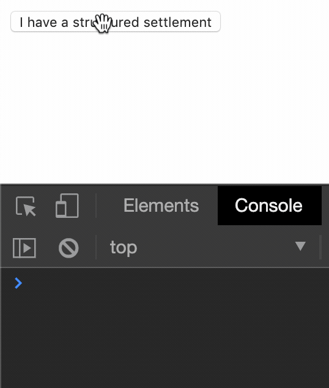

import UseTheForce from "./UseTheForce";


<figcaption>
  You ain't wild, ya mild. Photo: © pixabay @ pexels
</figcaption>

Y'all wanna see something wild? 🦒👀

---

## A little known method

There is a method in the React component class API that is fairly unknown and rarely used: [forceUpdate()](https://reactjs.org/docs/react-component.html#forceupdate).
As the React docs state,

> By default, when your component’s state or props change, your component will re-render.
> If your `render()` method depends on some other data, you can tell React that the component needs re-rendering by calling `forceUpdate()`

In a normal React application, changes to `props`, `state`, and even `context` is the main driver of component render cycles.
However, you ***can*** tell React to re-render your component without updating any of those things.
And one special way to do that is to call `forceUpdate()`.

Let's take a glance at what this may look like:

```jsx
class BadExample extends React.Component {
  iNeedCacheNow = () => {
    // call J.G. Wentworth, or just tell React we need it now
    this.forceUpdate();
  }

  render() {
    console.log('877-CASH-NOW!!!');

    return (
      <button type="button" onClick={this.iNeedCacheNow}>
        I have a structured settlement
      </button>
    );
  }
}
```

<figcaption>
  React component forceUpdate() example usage
</figcaption>

Yeah, I know the code is bad, but it's only ~~a reflection of my daily code production~~ *an example*.
***It actually doesn't do anything.*** <small><em><strong>kinda</strong></em></small>


<figcaption>
  Be a lot cooler if it did
</figcaption>

Here's what running the above code looks like:



<figcaption>
  🎶 877-CASH-NOW!!! 🎶
</figcaption>

One thing to be aware of is that `forceUpdate()` will skip `shouldComponentUpdate()` (which by default just [returns true](https://github.com/facebook/react/blob/1022ee0ec140b8fce47c43ec57ee4a9f80f42eca/packages/react-reconciler/src/ReactFiberClassComponent.js#L292)).

Going back to the React docs:

> Calling `forceUpdate()` will cause `render()` to be called on the component, skipping `shouldComponentUpdate()`.
> This will trigger the normal lifecycle methods for child components, including the `shouldComponentUpdate()` method of each child.
> **React will still only update the DOM if the markup changes.**

That last sentence simply means that calling `forceUpdate()` could end up being a `no-op` function, e.g. `() => {}`.
If nothing in the DOM will change by forcing a re-render, then you've done some wasted work on the UI thread.
[And we don't want that.](https://dassur.ma/things/when-workers/)

***Use*** `forceUpdate()` ***sparingly and with intention.***

---

## forceUpdate, the React hooks hway

If you've used React [hooks](https://reactjs.org/docs/hooks-intro.html), you've probably noticed that:

1. They're awesome 😎
2. They don't have a hook corollary to [componentDidCatch](https://reactjs.org/docs/react-component.html#componentdidcatch) or forceUpdate() (*hey, what gives??*)

Alright, well maybe you ***haven't*** noticed point #2.
That's *alright, alright, alright*.

It may not exist as a first class hook, but that can't stop us!
Let's write a custom hook!

```jsx
function useForceUpdate() {
  const [, forceUpdate] = React.useState();

  return React.useCallback(() => {
    forceUpdate(s => !s);
  }, []);
}
```

<figcaption>
  forceUpdate(), but as a hook: useForceUpdate
</figcaption>

### So, what does this hook do?

Well, it first calls `React.useState()` and passes nothing, or `undefined`, to the initial state.
Notice however, that it doesn't care about the first argument returned in the `useState` tuple, which is the ***state variable***.
We will soon see that this is okay though, because our initial state is `falsey`, which is just a funny way of saying that it evaluates to `false`.
The last thing that the `useForceUpdate` hook does is return a memoized callback that simply toggles the unnamed state variable.
Just like in the React class component method [setState](https://reactjs.org/docs/react-component.html#setstate), you can pass an *updater function* to the `React.useState` setter, as I've done here.
This updater function just happens to return the inverse of what the unnamed state variable currently is, e.g. `false` ➡️ `true`.

If you're unsure about what I mean by ***"memoized callback"***, that's okay.
In this case, we just want the function `() => { forceUpdate(); }` to always refer to the same underlying object reference.
So, we're caching, or remembering, what the function is, even across separate calls to `useForceUpdate`.
If you're curious for more info on memoization, check out this [wikipedia article](https://en.wikipedia.org/wiki/Memoization).

To answer the question ***"What does this hook do?"***, it allows you to force a re-render in your functional component without actually changing `props`, `state`, or `context`.

## Example Time! ⏰

Here's the part I've been wanting to show you.
But, before I reveal the code we will be running, I want to talk about a couple things.

First, let's touch back on what causes a React component to re-render.
As I mentioned before, a component will re-render if:

* its `shouldComponentUpdate` returns `true`
* its own internal state changes
* it receives new props
* the context it hooks into changes
* it's a class component that calls `forceUpdate()`

Notice that changing React [refs](https://reactjs.org/docs/refs-and-the-dom.html) doesn't cause a re-render.
Refs are nice for imperatively mutating DOM nodes.
I primarily use them for focus management: `ref.current.focus()`.
But, you can also use them to store instance-like-variables, even in functional components!
Keep in mind that changing these kinds of instance-like-variables ***won't trigger a re-render***.

Next, I wanna briefly talk about one of my favorite hooks: `React.useEffect()`.
And by briefly talk about, I really just mean referencing a tweet from [@ryanflorence](https://twitter.com/ryanflorence).

A quick and helpful guide on `React.useEffect`:

https://twitter.com/ryanflorence/status/1125041041063665666?lang=en

Now that that's out of the way, let's see some code, Cody! 🤓

```jsx
function UseTheForce() {
  const forceUpdate = useForceUpdate()
  const renderCount = React.useRef(0)

  React.useEffect(() => {
    renderCount.current += 1
  })

  const onClick = React.useCallback(() => {
    forceUpdate()
  }, [forceUpdate])

  return (
    <>
      <button type="button" onClick={onClick}>
        Use the Force 👋
      </button>
      <div>Render count: {renderCount.current}</div>
    </>
  )
}
```

And here it is, running <kbd>(((wild)))</kbd>.
Go ahead, give it a click. 👇

<UseTheForce />
<br />


<figcaption>
  Well there it is
</figcaption>

The oddball `UseTheForce` component, rendered in all its glory.


<figcaption>
  How neat is that? 🌲
</figcaption>

## Let's break it down 💃

First, we get our `forceUpdate` callback:

```jsx
// get the forceUpdate callback by calling the useForceUpdate hook
const forceUpdate = useForceUpdate()
```

<figcaption>
  Get the forceUpdate callback by calling the useForceUpdate hook
</figcaption>

Now, let's grab a `ref` to a *pseudo-instance-variable* counter, initialized to `0`:

```jsx
// let's retain some counting state without useState... with refs!
// initialize the ref.current value to 0
const renderCount = React.useRef(0)
```

<figcaption>
  Use state without useState, ya dig?
</figcaption>

Using our handy dandy ~~notebook 📕~~ `React.useEffect` guide from Ryan Florence, let's increment the counter ***on each render***:

```jsx
// add one to the render count ref's current value on each render
React.useEffect(() => {
  renderCount.current += 1
}) // don't pass any dependency array here, not even empty list []
```

<figcaption>
  Add one to the render count ref's current value on each render
</figcaption>

A simple click handler is necessary for the `<button>`:

```jsx
// When I click, you... don't click, just force the update!
const onClick = React.useCallback(() => {
  forceUpdate()
}, [forceUpdate])
```

<figcaption>
  Force an update when we click the button
</figcaption>

And finally, ~~draw the rest of the ****ing owl~~ the markup:

```jsx
// render the button and our "state variable" render count
return (
  <>
    <button type="button" onClick={onClick}>
      Use the Force 👋
    </button>
    <div>Render count: {renderCount.current}</div>
  </>
)
```

<figcaption>
  The example markup
</figcaption>

## Conclusion

**TLDR:** Don't do this.<sup>*</sup>

This was definitely an exercise in *what if?* territory.
While there are certainly [use cases](https://github.com/alphagov/accessible-autocomplete/blob/4bebed4a4799b39ee1cd493336988bafb53aa0ef/src/autocomplete.js#L302) for `forceUpdate()`, odds are you're better off using hooks, `props`, `state`, and `context` to declaratively render what you want and when.

If nothing in the DOM will change by forcing a re-render, then you've done some wasted work on the UI thread.
The UI thread is a precious resource and we should be using it as little as possible for maximum performance.

***Again, use*** `forceUpdate()` ***sparingly and with intention.***

Thanks for coming to my TED talk. After all, [all the cool kids are doing it](https://twitter.com/dan_abramov/status/1120987501072650240).

<sup>*</sup><small>Unless you have <em><strong>good reason</strong></em> to. <s>Terms and conditions</s> Nuance applies.
</small>
