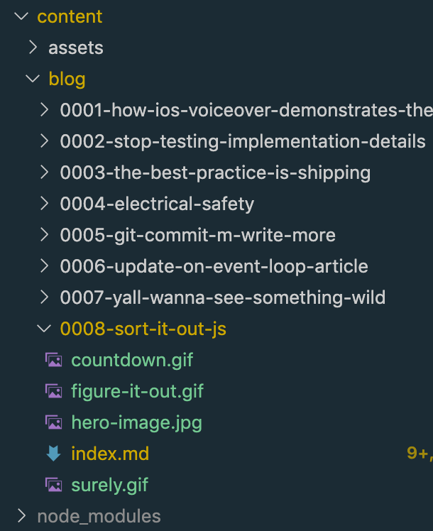

<figcaption>
  Photo by <a href="https://unsplash.com/@thetechnomaid?utm_source=unsplash&utm_medium=referral&utm_content=creditCopyText">Sophie Elvis</a> on <a href="https://unsplash.com/s/photos/sorting?utm_source=unsplash&utm_medium=referral&utm_content=creditCopyText">Unsplash</a>
</figcaption>

Fell for the ol' default JavaScript sorting algorithm trap when working with numbers. 😲

---

Tonight I made a script to [automate the boring stuff](https://automatetheboringstuff.com/) when creating a blog post.
It's a small-_ish_ node driven command line script that [scaffolds](https://github.com/dev-cprice/codyaprice.com/blob/3105787df9d879252b198a5e719817b20c6c2b64/scripts/new-post/index.js) out a new blog post using a template.
In my website's repo, like most (if not all) Gatsby driven static sites, my [posts](https://codyaprice.com/blog) are located under [content/blog](https://github.com/dev-cprice/codyaprice.com/tree/3105787df9d879252b198a5e719817b20c6c2b64/content/blog).
The directory names for each are prefixed with a zero-padded index, followed by a kebab-cased path (which is generally similar to the title and actually happens to be what makes up the slug).

For example, `0005-git-commit-m-write-more`, which maps to [this post](https://codyaprice.com/blog/git-commit-m-write-more).

For each new post I make, I simply increment that prefix number for superficial sorting within my `content/blog` directory.
While I do [order them by date](https://github.com/dev-cprice/codyaprice.com/blob/3105787df9d879252b198a5e719817b20c6c2b64/gatsby-node.js#L10) on my site, I like seeing my directory listed in posted order, since without the number prefix, the order is alphabetical.
While alphabetical is fine, I'm gaming the system since numbers are _"alphabetically before"_ letters.



<figcaption>
  Sorted blog directory
</figcaption>

Given the above context, my next blog post will be prefixed with `"0009"`.

## Who Wants to be a JavaScriptonaire?

So, what did I fall for?
Well, to explain, let's play a game.
The stakes are high.
The prize... _knawwwledge_.
Let's consider the following code snippet:

```js
const list = [10, 9, 8, 7, 6, 5, 4, 3, 2, 1]

const sortedList = list.sort()
```

<figcaption>
  Sorting a list of numbers in JavaScript.
</figcaption>

What will the result of the `sortedList` variable be?

|         |                                   |         |                   |
| ------- | --------------------------------- | ------- | ----------------- |
| **(A)** | `[1, 2, 3, 4, 5, 6, 7, 8, 9, 10]` | **(C)** | `"Bush did 911"`  |
| **(B)** | `[1, 10, 2, 3, 4, 5, 6, 7, 8, 9]` | **(D)** | None of the above |

I'll wait...
No peeking 🙈.
Or, you can cheat and [scroll down to the answer 😉](#the-correct-answer-is)


<figcaption>
  Countdown from 60 seconds ⏳
</figcaption>

## Array.prototype.sort(of?)

Let's go to my favorite site south of Reddit, [MDN](https://developer.mozilla.org/en-US/docs/Web/JavaScript/Reference/Global_Objects/Array/sort):

> The `sort()` method sorts the elements of an array in place and returns the sorted array. The default sort order is ascending, **_built upon converting the elements into strings, then comparing their sequences of UTF-16 code units values_**.

Emphasis mine.
Did you catch it?
While there are plenty of things to talk about here (like sorting in [place](https://twitter.com/_jayphelps/status/1196249744902967296)), let's focus on what happens when you don't provide your own comparator function.
Let's `.reverse()` and replay that back:

> The default sort order is ascending, built upon converting the elements into strings, then comparing their sequences of UTF-16 code units values.

So, the following list of numbers from ten down to one will be converted into strings when sorted.
Let's pretend we can see _pseudo-intermediary steps_, so that:

```js
const list = [10, 9, 8, 7, 6, 5, 4, 3, 2, 1]

const sortedList = list.sort()
```

<figcaption>
  Sorting a list of numbers in JavaScript.
</figcaption>

turns into _something like_:

```js
const list = [10, 9, 8, 7, 6, 5, 4, 3, 2, 1]

// convert list of numbers to strings
const listAsStrings = ["10", "9", "8", "7", "6", "5", "4", "3", "2", "1"]

// sort the list, convert back into numbers
const sortedList = listAsStrings.sort().map(number => parseInt(number, 10))
```

<figcaption>
  Sorting a list of numbers in JavaScript, but with pretend intermediary steps shown.
</figcaption>

Again, the default `.sort()` behavior is:

> comparing their sequences of UTF-16 code units values

which means that a **_comparison_** between two strings in the list is done character by character (really, [code point](https://en.wikipedia.org/wiki/Code_point) by code point) until one of them is considered alphabetically before the other, e.g. `"abc"` comes alphabetically before `"xyz"`.

---

## The Correct Answer Is...

If you answered **(A)**, you're...

...**_INCORRECT!_**

If you answered **(B)**, you're...

...**_CORRECT!_** <small>sadly... 😢</small>

**_Surely you can't be serious._**


<figcaption>
  I am serious, and don't call me Shirley.
</figcaption>

## The Problematic Code

The reason why this bit me is that I initially wrote the code to [calculate the _next_ prefix number](https://github.com/dev-cprice/codyaprice.com/blob/3105787df9d879252b198a5e719817b20c6c2b64/scripts/new-post/new-post-number.js) using `.sort()`.

Here's the old way I wrote it:

```js
function newPostNumber() {
  const postNumbers = fs
    .readdirSync(blogsPath) // read the content/blog directory, like `ls`
    .map(filename => parseInt(filename.split("-")[0], 10)) // get the prefix, as a number
    .filter(Boolean) // remove any falsey things, like things that don't match our pattern
    .sort() // sort the list in order
    .reverse() // reverse the list so I can pick the first one (last number)

  // increment the last number used by one
  const postNumber = postNumbers[0] + 1

  // pad the post number with up to 3 zeros (4 number slots)
  return `${postNumber}`.padStart(4, "0")
}
```

<figcaption>
  Problematic code
</figcaption>

> I used `.sort()`.

So, the list of **_numbers_** were converted to strings and then... well, you know the rest.
After `"0009"`, I would have been stuck generating `"0010-..."` directories! 😳

## The Fix

To fix the above code, all I needed to do was provide my own `comparator` function:

```diff
 - .sort()
 + .sort((lhs, rhs) => lhs < rhs)
```

<figcaption>
  Custom comparator function
</figcaption>

This comparator function returns true when the first argument is less than the second, forcing a swap between the two.
In other words, we're incrementing in ascending order, **_what we originally wanted_**.

```js
function newPostNumber() {
  const postNumbers = fs
    .readdirSync(blogsPath)
    .map(filename => parseInt(filename.split("-")[0], 10))
    .filter(Boolean)
    .sort((l, r) => l < r)
    .reverse()

  const postNumber = postNumbers[0] + 1

  return `${postNumber}`.padStart(4, "0")
}
```

<figcaption>
  The working code using a custom comparator function.
</figcaption>

## Conclusion

Look, I get it.
It works for strings.
The default sorting algorithm is pretty generic.
But maybe that's the problem?

In the wise words of the Letterkenny gang:

> JavaScript, you figure it out.


<figcaption>
  Figure it out.
</figcaption>
