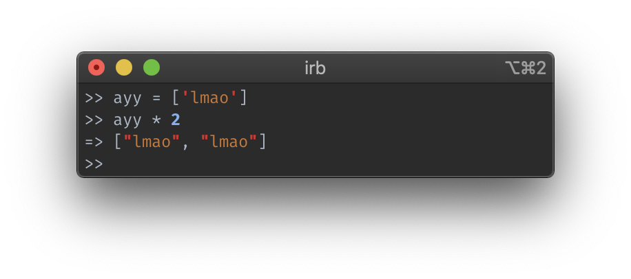
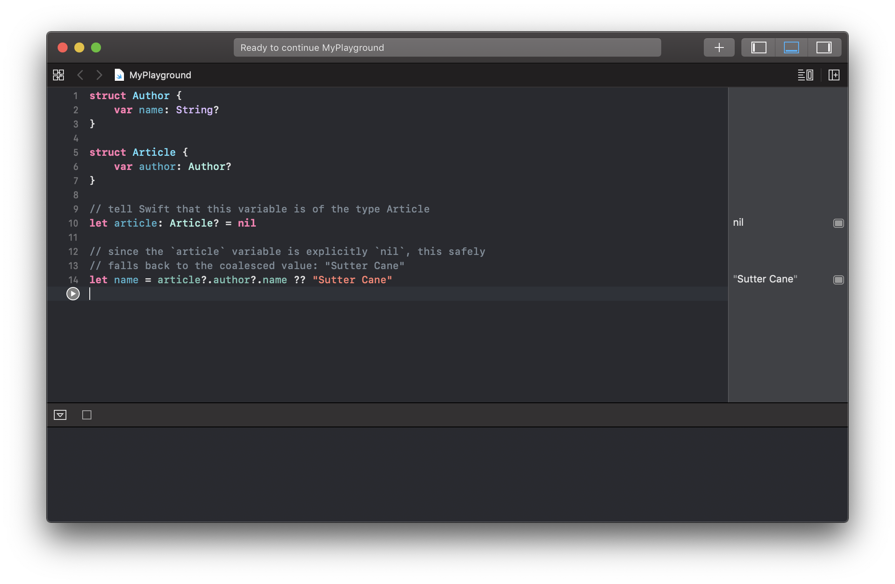
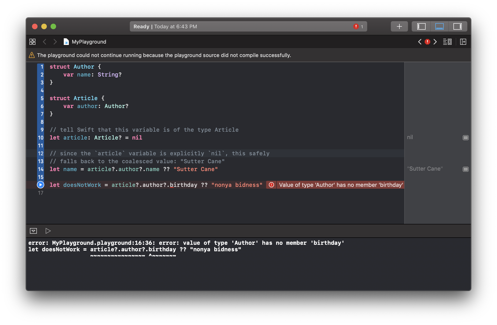

I haven't touched Ruby nor Rails in nearly a year.
However, this quarter, I'm working on some authentication and authorization work in our org's application SDK.
Coming from JavaScript as my daily driver, my velocity has definitely taken a hit.
But, that's a whole separate topic.

Instead, this post is all about how Ruby got their [safe navigation operator](https://en.wikipedia.org/wiki/Safe_navigation_operator) **_wrong_**.


<figcaption>
  Photo by <a href="https://unsplash.com/photos/BTvQ2ET_iKc">Chad Peltola on Unsplash</a>
</figcaption>

## What is safe navigation?

> Well, _it could be_ calling an Uber after a night out drinking, but... 💃

Safe navigation allows you to harmlessly access _potentially absent_ properties on an object **_without crashing your application_**.

### That's why it's safe.

I think this can be best explained by simple code examples.
I'll start by diving into what Ruby safe navigation does and what I don't like about it.
Next, I'll jump into some useful background knowledge that will provide some extra context.
I'll write in ~~my native tongue~~ JavaScript to demonstrate what I believe to be the ideal case and come to use what is called [optional chaining](https://developer.mozilla.org/en-US/docs/Web/JavaScript/Reference/Operators/Optional_chaining).
Finally, I'll follow up with some other prior art examples in other languages, like [Swift](https://docs.swift.org/swift-book/index.html).

## Ruby Safe Navigation, or ANDDOT: One Lonely Boi

The Ruby safe navigation operator is the combined characters `&.` and is called the _"and dot"_ operator, or colloquially **_"the lonely operator"_**.
It's "lonely" because it looks like someone [sitting alone on their laptop](https://instagram.com/p/-M9l6mRPLR/).
Odd, but 🤷‍♂️.

It was introduced in [Ruby v2.3.0 on December 25, 2015](https://www.ruby-lang.org/en/news/2015/12/25/ruby-2-3-0-released/).
As that post says, it behaves like `try!` of `active_support`:

> A safe navigation operator (so-called lonely operator) `&.`, which already exists in `C#`, `Groovy`, and `Swift`, is introduced to ease `nil` handling as `obj&.foo`...Note that this behaves like [`try!` of Active Support](http://api.rubyonrails.org/v4.2.5/classes/Object.html#method-i-try-21), which specially handles only `nil`.

Now, I want to point out something very important.
One thing that I actually really like about Ruby is that it's convention to label methods that either mutate, have side-effects, can raise (or throw) errors, or all of the above with a "bang": an exclamation point `!`.
So, if `&.` behaves like `try!`, which of those options are signaled by the `!`?

Welp, [it throws `NoMethodError`](https://api.rubyonrails.org/v6.0.0/classes/Object.html#method-i-try-21) 😒:

> `try!(*a, &b)`
>
> Same as try, but will raise a `NoMethodError` exception if the receiver is not `nil` and does not implement the tried method.

This is problematic and is the root cause of my dislike of this feature in Ruby.
But, before I can explain why, let's go over a little background first.

## Some Background

Let's jump into some useful background on typing and type systems, an interpreted language's runtime environment, and missing/undefined values.

Feel free to skip over this section if you're familiar with these concepts! ✌️
Here's the [skip link](#in-ruby-how-safe-is-safe), friend! ❤️

### Typing ⌨️

Like JavaScript, Ruby is dynamically typed, which just means that the underlying **types** of things can, and likely will, change at runtime.
If you're unfamiliar with what a [type](https://en.wikipedia.org/wiki/Type_system) is, it is basically a way to describe _what_ something, a variable for instance, is and how it interacts with other **_things_**.
A few examples may look like the following code snippet below.
_Keep in mind that the language being used in this example, Ruby, is fairly unimportant._

```ruby
# the number 10, as an integer
the_number_ten = 10

# my name, as a string (sequence of characters)
my_name_as_a_string = 'Cody Austin Price'

# my favorite bands, as a list of strings
my_favorite_bands = [
  'Gregory Alan Isakov',
  'W I L D',
  'First Aid Kit',
  'Joseph',
  'Sturgill Simpson'
]
```

<figcaption>
  A few examples of different types, written in Ruby
</figcaption>

Generally speaking, in a typed system, types don't necessarily _mix_ without explicitly describing how.
So, you can't necessarily add an `integer` to a `string`, like `5 + 'four'`, because **_they're different types_**, but **_you can_** add two `integer`s, like `5 + 10`.
However, in a dynamically typed language, [things can get weird](https://www.destroyallsoftware.com/talks/wat).
Alluva sudden you can multiply lists by integers and no one bats an eye!



<figcaption>
  Multiplying a list times two... 😳 wat
</figcaption>

### Runtime 🏃‍♂️

Similarly, both JavaScript and Ruby are interpreted languages, which means there is no typical "compilation" step prior to running like in C or Java.
Instead, the code is, you guessed it, interpreted by a runtime environment.
I'm glossing over a lot, but the rest is mostly unimportant for this post's topic.
The main takeaway is that _things_ (variables and types) aren't necessarily known **_until runtime_**.

### What's wrong? Nothing.

In most (all?) programming languages, there exists a special, [sentinel value](https://en.wikipedia.org/wiki/Sentinel_value) for _something that doesn't exist_ and is usually called `nil` or `null`.
In Ruby, we have `nil`, which is oddly an [object](https://docs.ruby-lang.org/en/master/NilClass.html).
JavaScript has a [`null`](https://developer.mozilla.org/en-US/docs/Web/JavaScript/Reference/Global_Objects/null), as well as [`undefined`](https://developer.mozilla.org/en-US/docs/Web/JavaScript/Reference/Global_Objects/undefined).

> The story so far: In the beginning both `null` and `undefined` were created in JavaScript.
> This has made a lot of people very angry and been widely regarded as a bad move.

There's really not that much of a difference between the two and often times they're interpretted by developers and business logic as the same: some `falsey`, non-existent thing or attribute.

In Ruby, while `nil` does have some methods like `#nil?` or `#to_s`, it does not implement `#method_missing`.
Don't worry if that sounds complicated, because it's just a silly way of saying that calling methods that don't exist on `nil` (e.g. your class' methods) will raise a `NoMethodError`.
In JavaScript, when accessing attributes on objects that don't exist, the runtime will return `undefined`.

### Disclaimer plus a note on JavaScript objects and Ruby hashes

I want to warn you that throughout this post, my JavaScript bias will probably show.
Part of this bias is my love for how powerful a standard JavaScript object (a simple key-value pair, dictionary, or hash map) is.
Namely, you can easily and dynamically describe the shape of data or an object.
You can access properties through bracket access, dot notation, or even destructuring.

```js
// an example object
const exampleObject = {
  foo: true
}

// bracket access, evaluates to true
const bracketAccess = exampleObject["foo"]

// dot notation access, evaluates to true
// this looks like method/property access on a typical OOP object 🤔
const dotNotation = exampleObject.foo

// destructuring access, evaluates to true
const { foo } = exampleObject
```

<figcaption>
  Demonstrating various ways of property access on JavaScript objects
</figcaption>

A big tradeoff for JavaScript objects is that you don't get any type benefits out of the box, so typos can kill you.

> Did I say `onlick`? 👅👅👅 What I meant was _`onClick`_!

The Ruby counterpart to a JavaScript object is called a hash.
Hashes are similar to JavaScript objects, but have some key differences.
Most importantly, you _cannot_ use dot notation on them to access properties.
Destructuring also doesn't exist in Ruby.
So you're left to use the **_old way_** for accessing properties on a hash, via brackets.
Lame!
Also, hashes aren't checked against a blueprint either, so they fall prey to the same problem of typos as JavaScript objects do.

Now, dot notation does exist in Ruby, but it is reserved for accessing attributes and methods on classes.

```ruby
# let's make a weird hash of hashes
a_hash = { foo: { bar: { baz: 'buz' } } }

# access things in the hash using bracket notation
a_hash[:foo][:bar] #=> { baz: 'buz' }

# let's make a simple class
class Foo
  def bar
    'baz'
  end
end

# get an instance of Foo
foo = Foo.new

# access the #bar method on the foo instance via dot notation
foo.bar #=> 'baz'
```

<figcaption>
  Demonstrating accessing properties on hashes and objects in Ruby
</figcaption>

> Why does all this matter, Cody? 🤔

The differences between JavaScript objects and Ruby objects and hashes matters because **_they are reflected in the differences in how the two languages handle safe navigation_**.

Wild.

Now that we've explained that, let's look at some code.

## In Ruby, how safe is safe?


<figcaption>
  Photo by <a href="https://unsplash.com/@tangcindy">Cindy Tang</a> on <a href="https://unsplash.com">Unsplash</a>
</figcaption>

So, in Ruby, how safe is safe navigation?

> Spoiler alert: not very.

TODO: writeme

## Safe Navigation, in JavaScript

Let's begin our exploration of safe navigation in JavaScript with a contrived example:

```js
const conspiracy = {
  bush: {
    did: "911"
  }
}

// 👇 this will throw, see below
const fakeNews = conspiracy.epstein.suicide
// Thrown:
// TypeError: Cannot read property 'suicide' of undefined
```

<figcaption>
  When accessing attributes of objects that don't exist (are <code class="language-text">undefined</code>), it throws an error
</figcaption>

In the above example, because _Epstein didn't commit suicide_, the JavaScript runtime throws an exception.
There's simply no attribute called `epstein`, nor a child attribute called `suicide` in the `conspiracy` object.
Trying to access anything on `undefined` throws a `TypeError`.

Prior to _optional chaining_, you would need to do something like the following to safely access properties that may or may not exist:

```js
const conspiracy = {
  bush: {
    did: "911"
  }
}

// do a truthiness check for all nested attribute accesses
if (conspiracy.epstein && conspiracy.epstein.suicide) {
  console.log(
    "Epstein committed suicide and here's the proof: ",
    conspiracy.epstein.suicide
  )
} else {
  console.log("We all know the truth, tho 😉")
}
```

<figcaption>
  Demonstrating truthiness checks with <code class="language-text">&&</code> in JavaScript for nested attribute access.
</figcaption>

Performing truthiness checks with `&&` for shallow objects is _mostly fine_.
However, as you can see, even for doubly-nested attributes, it becomes cumbersome and quite verbose!

But, we have been blessed with **_optional chaining!_** 😇

```js
const conspiracy = {
  bush: {
    did: "911"
  }
}

// unlike before, 👇 this DOES NOT throw! 🙌
// fakeNews will safely be `undefined`
const fakeNews = conspiracy?.epstein?.suicide
```

<figcaption>
  Optional chaining in JavaScript, so terse and easy!
</figcaption>

Optional chaining allows us to write elegant and terse code that is easier to read and maintain.
It allows us to **_safely navigate_**, or drill down, through a nested object shape _without having to worry about or manually check for the presence of attributes!_

## What does this look like in other languages?

Safe navigation isn't new.
There a plenty of other languages that have implemented it prior to both Ruby and JavaScript.
Let's look at a couple!

### Swift

In Swift, which is a typed **_and compiled_** language, we have the following:

```swift
struct Author {
  // an optional attribute, name
  var name: String?
}

struct Book {
  // another optional attribute, author
  var author: Author?
}

// tell Swift that this variable is of the type Book
let book: Book? = nil

// since the `book` variable is explicitly `nil`, this safely
// falls back to the coalesced value: "Sutter Cane"
let name = book?.author?.name ?? "Sutter Cane"
```

This example is kind of silly, sure, but it illustrates optional chaining in Swift.
I'll go ahead and run the above code in a handy dandy Xcode playground:



<figcaption>
  Demonstrating working optional chaining in a Swift Xcode playground
</figcaption>

The pane on the right-hand side shows the result of the expressions on lines 10 and 14.
On line 10, a constant of type `optional Article` is initialized to `nil`.
On line 14, we use optional chaining to try to access the deeply nested attribute `name`.
Since we are operating on a `nil` value, each link along the optional chain will fail, but safely fallback to `nil`.
At the end of the chain, we use _null coalescing_ operator to set a default value of the string `"Sutter Cane"`.
So the final result, as the right pane shows, is that `name = "Sutter Cane"`.

What happens when you try to access properties that **_don't exist?_**



<figcaption>
  Demonstrating what optional chaining can't do in a Swift Xcode playground
</figcaption>

In this case, the compiler will throw an error because the `Author` type **_doesn't have an attribute called_** `birthday`!

The implications of Swift being typed means that _the compiler_ knows ahead-of-(run)time the shape of data structures and _other things_.
This matters because the compiler can and will yell at you if you try to pull some _JavaScript-like_ object schema.
In other words, it's a lot harder in Swift to define an object or dictionary that is `any?` all the way down since **_the shape or structure of your data is known at compile time_**.

Oddly enough, even though Ruby is dynamically typed and interpreted, its safe navigation behaves **_more like Swift's as opposed to JavaScript's!_**
I'll explain why later.

Let's take a look at one more language and its take on safe navigation.

### C

> Lol, jk.

Just kidding.
There's no safe navigation here.
In C, nothing is sacred and your safe navigation is in another ~~castle~~ language!

---

## Conclusion

TODO: writeme
