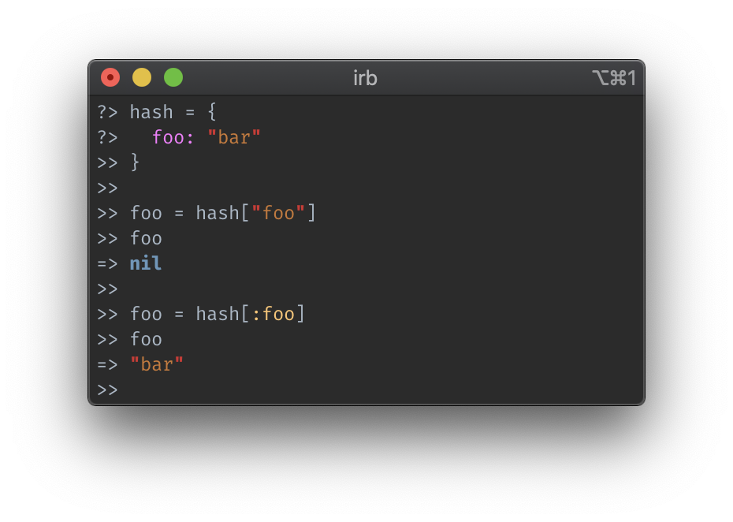
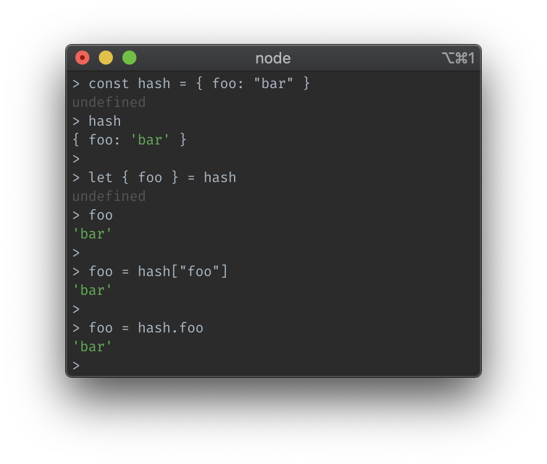
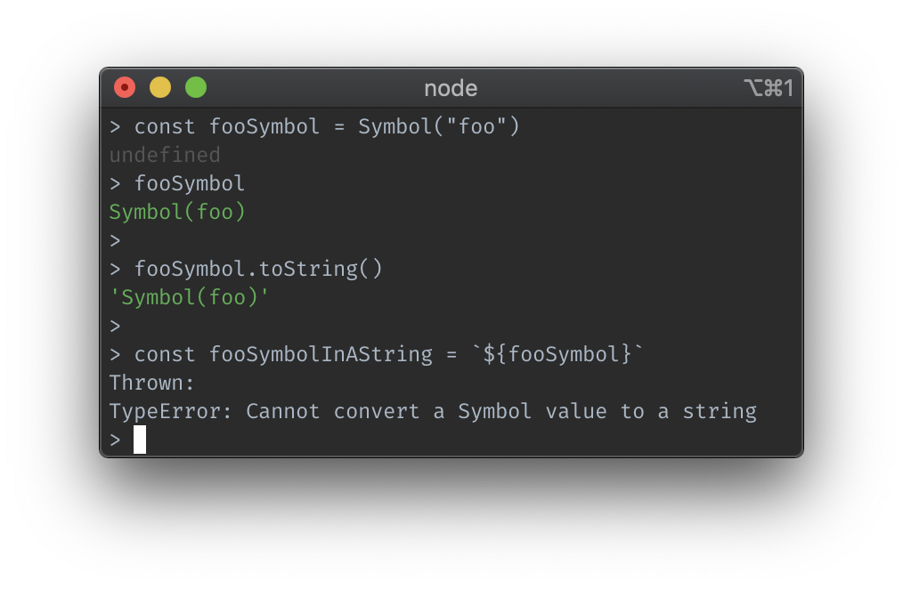
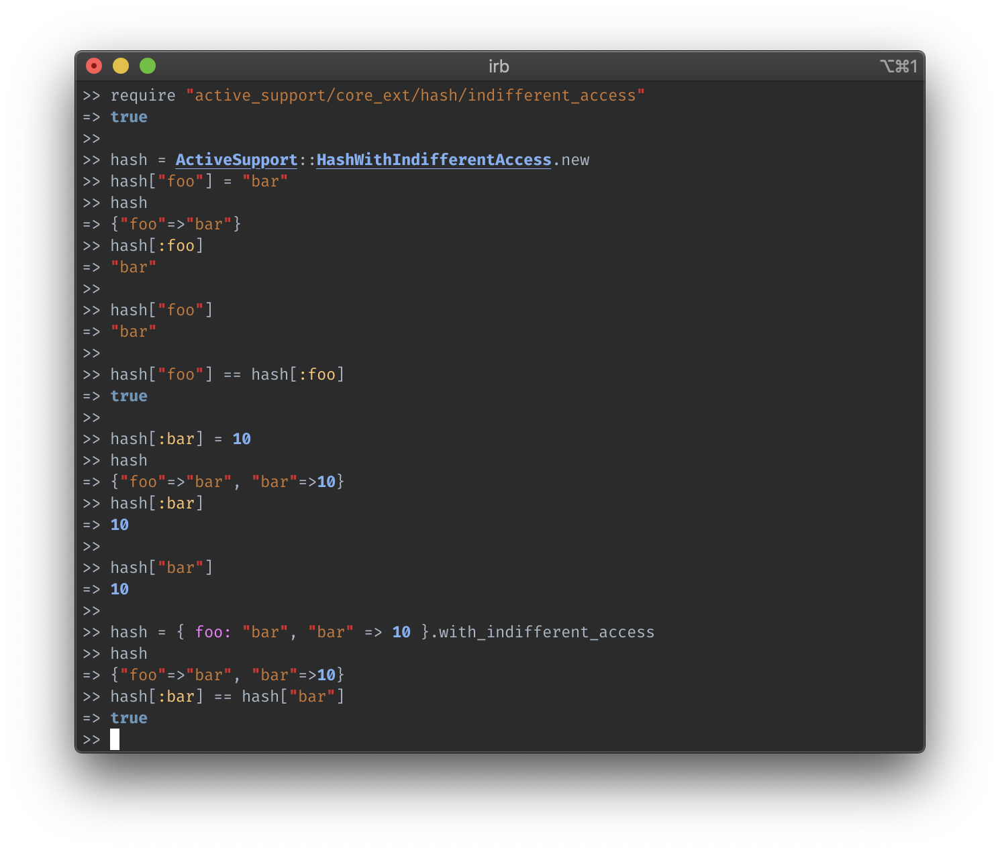

<figcaption>
  A nice hash, unlike Ruby's 😂, Photo by <a href="https://pixabay.com/photos/root-potato-hash-healthy-vegetable-1112017/">ctwoner</a> on <a href="https://pixabay.com/">Pixabay</a>
</figcaption>

I miss plain old JavaScript objects... 😔

---

## **_sigh_** Ruby hashes

A Ruby `hash` is a **_key-value pair_** container which can be made with either a `hash` literal `{}` or constructor `Hash.new`.
They're known as _dictionaries_ or _associative-arrays_ and allow you to store **_values_** that can be accessed by a **_key_**.
If you're acquainted with [JSON](https://www.json.org/json-en.html) or [JavaScript objects](https://developer.mozilla.org/en-US/docs/Web/JavaScript/Reference/Global_Objects/Object), this should look familiar.
When it comes to values, they can be anything, even other nested hashes!
Keys are generally either `string`s or `symbol`s (like a Ruby `string`, _but stronk_, [docs here](https://ruby-doc.org/core-2.6.5/Symbol.html)) for simplicity, but you can use anything that is an _"object type"_.
Reaching for the [Ruby docs](https://ruby-doc.org/core-2.6.5/Hash.html#class-Hash-label-Hash+Keys), we see that:

> A user-defined class may be used as a hash key if the `hash` and `eql?` methods are overridden to provide meaningful behavior. By default, separate instances refer to separate hash keys.
>
> A typical implementation of `hash` is based on the object's data while `eql?` is usually aliased to the overridden `==` method

This just means many things, even complex objects you or others write, can evaluate to hash keys.

## Accessing Hash Values

In the beginning, I mentioned that hashes are referred to as _associative-arrays_.
This is because while arrays, or lists of items, are indexed by numbers, e.g.:

```ruby
# list has 3 items (a .length equal to 3)
list = ["first", "second", "third"]

# notice below that we are accessing the list items by a number index
# ruby arrays use 0-based indexing, or the first item is the 0th index
first = list[0]
second = list[1]
```

hashes, on the other hand, use **_generic_** keys, e.g.:

```ruby
# declare a new hash using a hash literal
# I'm only using strings as values here, but
hash = {
  nested: {
    "look ma" => "I'm in a nested hash!"
  },
  foo: "bar", # symbol notation
  "three" => 3, # fat arrow notation, which is necessary for string and number keys
  4 => "four"
}

# get the nested hash using a symbol key
nested_hash = hash[:nested]

# get the three value using a string
three = hash["three"]

# we can even use numbers as keys!
four = hash[4]
```

## Where's the beef? 🐄

So far, hashes look pretty neat, right?
Well, for the most part, they are.
They're used **_all the time_**, especially in Rails applications.
However, what do you think happens when you try the following?

```ruby
hash = {
  foo: "bar" # a symbol key, :foo
}

# notice: the foo key is a symbol,
# but instead we're trying to access using a string
foo = hash["foo"]
```

The answer?



<figcaption>
  Example: Hash access using a string when the key is a symbol
</figcaption>

We can't access the `foo` value using the string `"foo"`, but instead have to use the symbol `:foo`.
Mildly put, this is annoying.

Coming from JavaScript land, objects have [shorthand property names](https://developer.mozilla.org/en-US/docs/Web/JavaScript/Reference/Operators/Object_initializer#New_notations_in_ECMAScript_2015), which looks strikingly similar to symbol notation for Ruby hash keys:

```js
const hash = {
  foo: "bar"
}

// accessing with object destructuring works
let { foo } = hash

// as does with a string works
foo = hash["foo"]

// as does named property access
foo = hash.foo
```



<figcaption>
  Example: Node object access
</figcaption>

Keep in mind that I've purposefully left out ES2015 [Symbols](https://developer.mozilla.org/en-US/docs/Glossary/Symbol), as they are _different from Ruby symbols_.
Mainly, they don't coerce to strings easily.
And, when converting them to strings using `.toString()`, for example, they produce `"Symbol(<VALUE>)"`, e.g.:



> What do you want Cody?


```ruby
hash = { foo: "bar" }

this = hash[:foo]
that = hash["foo"]

this == that #=> true
```

## Rails to the Rescue 🛤

Rails has a weird symbiotic relationship with Ruby and will constantly [monkey-patch](https://culttt.com/2015/06/17/what-is-monkey-patching-in-ruby/) the core library, or at least provide extensions to it.
The extension that will save us is [ActiveSupport::HashWithIndifferentAccess](https://api.rubyonrails.org/classes/ActiveSupport/HashWithIndifferentAccess.html), where:

> Implements a `hash` where keys `:foo` and `"foo"` are considered to be the same.

A hash of this type can be made either using:

```ruby
# the ActiveSupport::HashWithIndifferentAccess constructor
hash = ActiveSupport::HashWithIndifferentAccess.new

# or, a hash literal followed by `.with_indifferent_access`
hash = {}.with_indifferent_access
```

Here it is in action:



<figcaption>
  Example: Using the Rails Hash With Indifferent Access Extension
</figcaption>

**_And I LOVE it_**.

## Conclusion

TLDR: Indifferent access hashes are what hashes should have been in the first place.

I shouldn't have to care whether you give a hash `:foo` or `"foo"` to access something.
**_Both of those cases should behave identically_**.
If it did, APIs that return hashes wouldn't need to use something like [deep_symbolize_keys](https://api.rubyonrails.org/classes/Hash.html#method-i-deep_symbolize_keys-21).
Also, why are these highly valuable things not in Ruby core yet??

And that's why I miss POJOs: Plain Old JavaScript Objects.
And why I'm so **_indifferent_** 😉with Ruby hashes.
