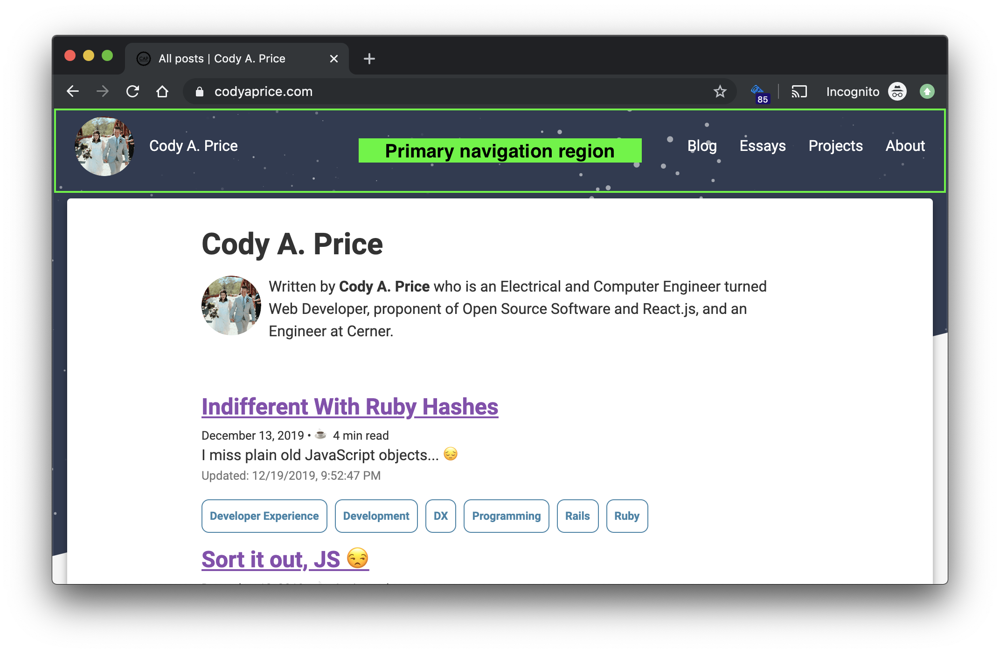
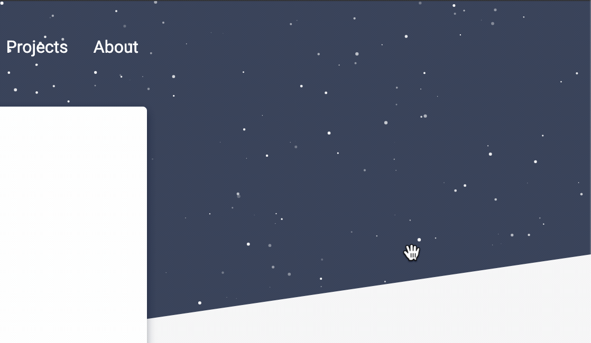
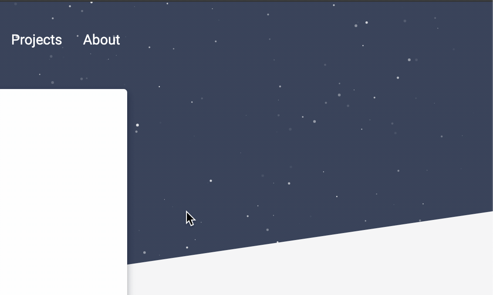
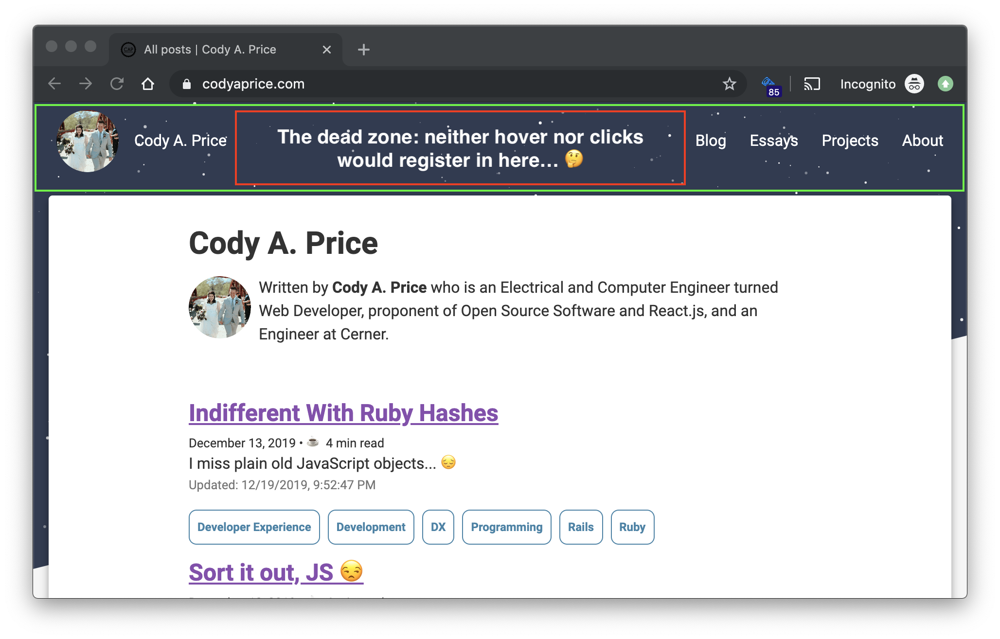
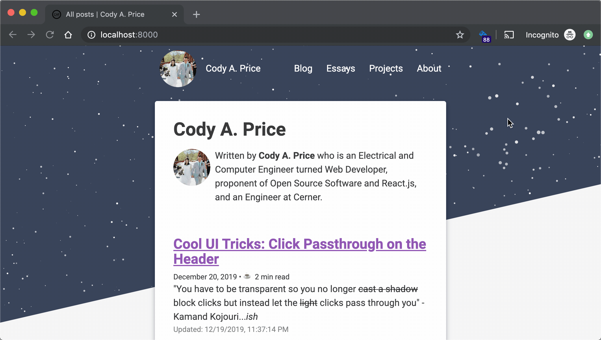
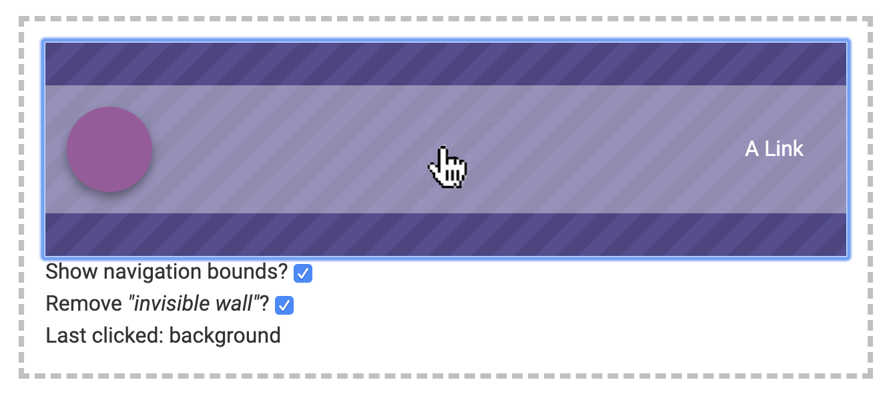

import Example from "./Example"

<figcaption>
  Photo by <a href="https://unsplash.com/@aleksdahlberg?utm_source=unsplash&utm_medium=referral&utm_content=creditCopyText">Aleks Dahlberg</a> on <a href="https://unsplash.com/s/photos/transparent?utm_source=unsplash&utm_medium=referral&utm_content=creditCopyText">Unsplash</a>
</figcaption>

> "You have to be transparent so you no longer ~~cast a shadow~~ block clicks but instead let the ~~light~~ clicks pass through you" - Kamand Kojouri..._ish_

---

I recently updated my primary navigation.
You know, this thing:

Underneath the primary navigation is a [stripe](https://www.stripe.com) inspired header.
Inside the clipped header is a `<canvas>` element that renders a starry background that you can interact with through hover and clicking.
Hovering produces a _"brightening"_ effect on stars adjacent to the mouse, like so:

<figcaption>
  Navigation mouse hover animation
</figcaption>

And clicking allows you to _"blow up"_ the stars, blasting them in all directions:

<figcaption>
  Navigation mouse click interaction
</figcaption>

## The Problem

The navigation is rather delightful to play with.
Unfortunately, you originally could not click or hover on the region between my name and the navigation links.

<figcaption>
  Call my navigation Sprint because this was a dead zone, my friend. 🤙
</figcaption>

Even though there doesn't appear to be anything between my name and the list of links, pointer interactions fail to register!

<figcaption>
  The navigation blocks any interactions with the stars! 🙅‍♂️
</figcaption>

## Interactive Example Time ⏰

Let's play around with some interactable examples!
In each example, you can click and hover on things within the dashed boxes.
I've created a mock navigation header that loosely resembled the primary navigation on my site.
Think of it like if you turned the graphics settings **_way_** down.

For this first example, I want to demonstrate the way my navigation originally worked; or, what happens when the navigation blocks interaction as if there's an invisible wall.

As you click on items, the _"Last clicked"_ element will update to display what you last clicked on.
You can do the following:

- The background is both _clickable_ **and** _hoverable_
- The avatar circle is both _clickable_ **and** _hoverable_
- The navigation region is _clickable_
- You can toggle on/off the visibility of the navigation bounds (note: this does not remove them entirely; they are still rendered, but will just be completely transparent or invisible)

_Isn't it odd that there's a central region where an interactivity dead zone exists?_

<Example />
 

<figcaption>
  An interactable example displaying our "invisible wall"
</figcaption>

## What Went Wrong

The above behavior is unsurprising if you're familiar with DOM flow and stacking contexts.
But, to the average person, it provides a **_bad user experience_** because it breaks the [Principal of Least Astonishment](https://en.wikipedia.org/wiki/Principle_of_least_astonishment).
You would expect the starry background in my primary navigation to be interactable in all of its rendered regions.
It is jarring to experience that _"invisible wall"_.
I want to explain more on why this wall exists, but first, here's the same example from above, but now you can also toggle on/off the _"invisible wall's"_ **_"presence"_**.

<Example
  pointerEventPassthroughEnabled
  passthroughInitialValue
/>
 

<figcaption>
  An interactable example with the ability to remove the "invisible wall"
</figcaption>

When the navigation bounds are visible, but we remove the _"invisible wall"_, the background can receive our click!

<figcaption>
  Still image: The click passes through the navigation region and registers on the background!
</figcaption>

## How it Works

TLDR: [pointer-events](https://developer.mozilla.org/en-US/docs/Web/CSS/pointer-events)!

There is a CSS property called `pointer-events` which allows you to manipulate if a DOM element receives pointer events (e.g. `click`s, `hover`, etc).

`// TODO: writeme`

## Conclusion

`// TODO: writeme`
