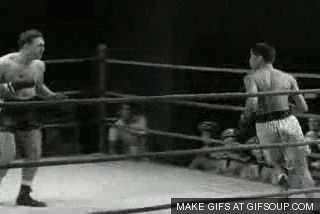

import MockNavigation from "./MockNavigation"
import DestroyAllClicks from "./DestroyAllClicks"
import BoxModel from "./BoxModel"


<figcaption>
  Photo by <a href="https://unsplash.com/@aleksdahlberg?utm_source=unsplash&utm_medium=referral&utm_content=creditCopyText">Aleks Dahlberg</a> on <a href="https://unsplash.com/s/photos/transparent?utm_source=unsplash&utm_medium=referral&utm_content=creditCopyText">Unsplash</a>
</figcaption>

> "You have to be transparent so you no longer ~~cast a shadow~~ block clicks but instead let the ~~light~~ clicks pass through you" - Kamand Kojouri..._ish_

---

I recently updated my primary navigation.
You know, this thing:


<figcaption>
  Primary navigation, with minor annotations.
</figcaption>

Underneath the primary navigation is a [stripe](https://www.stripe.com) inspired header.
Inside the clipped header is a `<canvas>` element that renders a starry background that you can interact with through hover and clicking.
Hovering produces a _"brightening"_ effect on stars adjacent to the mouse, like so:


<figcaption>
  Navigation mouse hover animation
</figcaption>

And clicking allows you to _"blow up"_ the stars, blasting them in all directions:


<figcaption>
  Navigation mouse click interaction
</figcaption>

## The Problem

The navigation is rather delightful to play with.
Unfortunately, you originally could not click or hover on the region between my name and the navigation links.


<figcaption>
  Call my navigation Sprint because this was a dead zone, my friend. 🤙
</figcaption>

Even though there doesn't appear to be anything between my name and the list of links, pointer interactions fail to register!


<figcaption>
  The navigation blocks any interactions with the stars! 🙅‍♂️
</figcaption>

Bummer! 😢

> How do we fix that!? 🧐

## Interactive Example Time ⏰

Let's play around with some interactable examples!
In each example, you can click and hover on things within the dashed boxes.
I've created a mock navigation header that loosely resembled the primary navigation on my site.
Think of it like if you turned the graphics settings **_way_** down.

For this first example, I want to demonstrate the way my navigation originally worked; or, what happens when the navigation blocks interaction as if there's an invisible wall.

As you click on items, the _"Last clicked"_ element will update to display what you last clicked on.
You can do the following:

- The background is both _clickable_ **and** _hoverable_
- The avatar circle is both _clickable_ **and** _hoverable_
- The navigation region is _clickable_
- You can toggle on/off the visibility of the navigation bounds (note: this does not remove them entirely; they are still rendered, but will just be completely transparent or invisible)

_Isn't it odd that there's a central region where an interactivity dead zone exists?_

<Example caption={`An interactable example displaying our "invisible wall"`}>
<MockNavigation />
</Example>

## What Went Wrong

The above behavior is unsurprising if you're familiar with DOM flow and stacking contexts.
But, to the average person, it provides a **_bad user experience_** because it breaks the [Principal of Least Astonishment](https://en.wikipedia.org/wiki/Principle_of_least_astonishment).
You would expect the starry background in my primary navigation to be interactable in all of its rendered regions.
It is jarring to experience that _"invisible wall"_.
I want to explain more on why this wall exists, but first, here's the same example from above, but now you can also toggle on/off the _"invisible wall's"_ **_"presence"_**.

<Example caption={`An interactable example with the ability to remove the "invisible wall"`}>
<MockNavigation
    pointerEventPassthroughEnabled
    passthroughInitialValue
  />
</Example>

When the navigation bounds are visible, but we remove the _"invisible wall"_, the background can receive our click!


<figcaption>
  Still image: The click passes through the navigation region and registers on the background!
</figcaption>

## How it Works

TLDR: [pointer-events](https://developer.mozilla.org/en-US/docs/Web/CSS/pointer-events)!

There is a CSS property called `pointer-events` which allows you to manipulate if a DOM element receives pointer events (e.g. `click`s, `hover`, etc).
If you set it to `none`, then that element and all of its children will no longer process pointer events!

🤯

Let's look at the simplified DOM of my navigation with minimal styling using [emotion, an incredible css-in-js library](https://emotion.sh/docs/introduction):

```jsx
/* top level element sets pointer events to none */
<div css={{ pointerEvents: "none" }}>
  <div css={{
    display: "flex",
    alignItems: "center",
    position: "relative" {/* 👈 this is important */}
  }}>
    {/* The starry background 👇*/}
    <div css={{ position: "absolute" }}> {/* 👈 this is important */}
      <canvas>✨</canvas>
    </div>
    <nav
      css={{
        display: "flex",
        justifyContent: "space-between",
        position: "relative" {/* 👈 this is important */}
      }}
    >
      {/* manually enable pointerEvents for all children after here */}
      <a href="#" css={{ pointerEvents: "auto" }}>
        Cody A. Price
      </a>
      <ul
        css={{
          display: "flex",
          listStyle: "none",
          margin: 0,
          pointerEvents: "auto"
        }}
      >
        {/*
          These will inherit `pointer-events: auto;`
          from the parent <ul> by default
        */}
        <a href="#">Blog</a>
        <a href="#">About</a>
      </ul>
    </nav>
  </div>
</div>
```

Notice that we turn off all `pointer-events` on the parent element and then selectively turn `pointer-events` back on for **_specific children_**.


<figcaption>
  If you're saying I play favorites, you're wrong. I love all my children equally.
</figcaption>

### Unpacking it All

There's a lot to unpack here, so let's get down to business.


<figcaption>
  Let's get down to business!
</figcaption>

We need to talk about DOM flow, the box model, positioning, and stacking contexts.
Be warned, I am going to gloss over a lot of the details because these topics deserve a post in themselves.
There's a ton of nuance at play, so **_readers ye be warned_** 🏴‍☠️, but please bear with me 🐻.
Feel free to skip this section (or sections) if you're up to speed on these topics.

[Skip link](#you-got-your-chocolate-in-my-peanut-butter-)

- [The Box Model](#the-box-model)
- [DOM Flow](#dom-flow)
- [Positioning](#positioning)
- [Stacking Contexts](#stacking-contexts)

For everyone else, let's go! 🏌️‍♂️
First, let's talk through the box model.

#### The Box Model



<figcaption>
  The boxing model, probably a derivative of or adjacent to border-box 🥁🤷‍♂️😂
</figcaption>

In HTML and CSS, everything is a box or rectangle (even circular things)!
You can manipulate each box's size, position, and presentational styling using CSS.
According to MDN's [box model docs](https://developer.mozilla.org/en-US/docs/Web/CSS/CSS_Box_Model/Introduction_to_the_CSS_box_model):

> Every box is composed of four parts (or areas), defined by their respective edges: the content edge, padding edge, border edge, and margin edge.


<figcaption>
  MDN's Box Model Graphic
</figcaption>

You should also be aware of the difference between `inline` or `block` elements.
What's described above is directly applicable to `block` elements.
MDN also has a great [doc](https://developer.mozilla.org/en-US/docs/Web/CSS/CSS_Flow_Layout/Block_and_Inline_Layout_in_Normal_Flow#Elements_participating_in_an_inline_formatting_context) on `inline` vs `block` flow, but the main takeaways are:

- They are only as big as they need to be, e.g. words or text. Think of them as a box, but with shrinkwrap to take up as little space as possible.
- When placed next to one another, they _"flow"_ together in the document's text direction, e.g. left to right.
- They are still "boxes", but you can't determine their size directly

Lastly, for understanding the box model, let's go through an interactive example of `box-sizing`.
In the following rendering, you can change the properties of each box and see their size and visual properties update in real-time.
It should give you a good idea of how the box model works in general!

<Example caption={(
  <>
    Interactive Example: Demonstrate the difference between <code>box-sizing</code> types: <code>content-box</code> (initial & default) vs <code>border-box</code>
  </>
)}>
  <BoxModel />
</Example>

Next, we're drifting into DOM flow. 🌊

#### DOM Flow

For starters, there's [normal flow](https://developer.mozilla.org/en-US/docs/Learn/CSS/CSS_layout/Introduction#Normal_flow), which MDN says is:

> Normal flow is how the browser lays out HTML pages by default when you do nothing to control page layout.
>
> Note here how the HTML is displayed in the exact order in which it appears in the source code, with elements stacked up on top of one another

By default for English locales (bear with me 🐻, I'm glossing over a lot of details), the markup is rendered from left to right, top to bottom.
Block

Now, let's _position_ ourselves to understand the remaining two sections.

#### Positioning

> Position yourself well enough, and circumstances will do the rest
>
> Mason Cooley

`// TODO: writeme`

And finally, it's time to _rack em', **stack** em', and pack em'_.

#### Stacking Contexts

> You can do anything with stacks and iteration that you can do with recursion
>
> Steve McConnell

`// TODO: writeme`

## You Got Your Chocolate in my Peanut Butter 😔

It seems kind of odd to me that such behavior is delegated to CSS instead of Javascript.
I mean, it's not like [`cursor: pointer`](https://developer.mozilla.org/en-US/docs/Web/CSS/cursor) where it's a **_purely "presentational"_** effect.
With Javascript, (examples following being of the React flavor) you enhance DOM elements by adding `event listeners` which trigger on interactions providing the desired functionality.
By setting `pointer-events: none;` on a DOM element, you are turning off all cursor interactions for **_it and its children!_**
This is crazy to me! 😜
Sounds an awful lot like a Javascript concern, namely something like:

```js
function DestroyAllClicks() {
  const [count, setCount] = React.useState(0)

  function increment() {
    setCount(c => c + 1)
  }

  function preventAllClicks(event) {
    event.preventDefault()
    event.stopPropagation()
  }

  return (
    <div onClickCapture={preventAllClicks}>
      <button type="button" onClick={increment}>
        Increment count
      </button>
      <p>Count = {count}</p>
    </div>
  )
}
```

<Example caption="Interactive example: prevent all click handlers from processing in children using Javascript">
  <DestroyAllClicks />
</Example>

It pushes me further and further from the _misguided_ belief that your ~~peanut butter shouldn't mix with my chocolate~~ UI concerns should be separated.
The lines are so blurred now.
Javascript isn't just for adding _"functionality"_, it's also for rendering and animations.
CSS isn't just for presentational styling, it's also for interactivity/functionality.
And with web components, well, the lines continue to be blurred!

## Conclusion

I strive for great UX, but it's a constant battle.
This site, as of writing this article, still has a long way to go, but **_iterators gonna iterate_**.
It's all too easy to get caught up in the technical details when developing something.

- What should `${it}` do?
- What are the requirements?
- Do you provide a good user experience?

Initially, I thought I hit the mark for my navigation bar (technically I still haven't because my mobile nav is atrocious 😲🤷‍♂️😂).
But, only by taking a step back and looking at the full context of where the navigation was rendered and how it should interact with its adjacent elements (in the DOM order or stacking order) was I able to fully address my requirements and provide a good user experience.
And I got to learn about and use a cool, but odd CSS property along the way!
