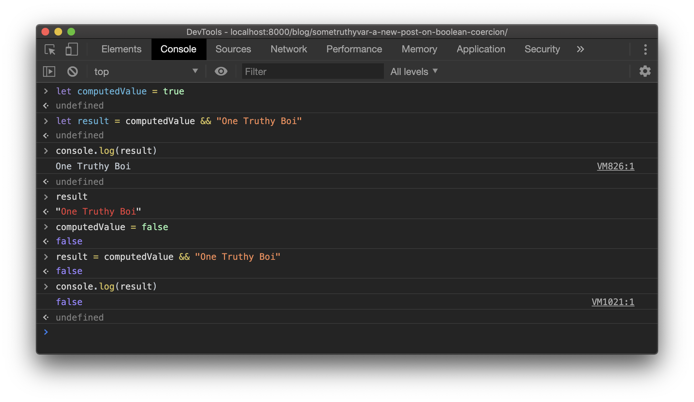

import ListLengthExample from "./ListLengthExample"


<figcaption>
  Photo by <a href="https://unsplash.com/@clemhlrdt">Clément H</a> on <a href="https://unsplash.com/s/photos/javascript-plant">Unsplash</a>
</figcaption>

~~Click now~~ Keep reading to see the beginner's guide to what `computedValue && "One Truthy Boi"` evaluates to!

---

## To truthy, or not to truthy?

Let's do a little code experiment.
How does the value of `computedValue` affect what the expression `computedValue && "One Truthy Boi"` evaluates to?
Well, let's take a gander in `${insertYourFavoriteJavascriptConsole}` (I'll run mine in the Chrome browser console).

When `computedValue` is _truthy_:

```js
let computedValue = true
let result = computedValue && "One Truthy Boi"
console.log(result) // "One Truthy Boi"
```

Versus when `computedValue` is _falsey_:

```js
let computedValue = false
let result = computedValue && "One Truthy Boi"
console.log(result) // false
```

And to prove it, a screenshot of it running:



<figcaption>
  Console output of running the above code snippets.
</figcaption>

Strange.
So, `result` will either be `false` or `"One Truthy Boi"` depending on what the left-hand-side of the `&&` boolean operation evaluates to.
Interesting... 🤔

## Why this is weird to me

It turns out this is a pretty standard feature in dynamic languages like JavaScript, Ruby, and Python.
However, if you're coming from the land of types, this is... odd.
To understand why let's take a look at a little history...

Normally, when performing `(left expression && right expression)`, you're checking for a `true` or `false` evaluation, like in a conditional expression for an `if/else` block.
This is called a _boolean expression_ and evaluates to either `true` OR `false` (two values only; one or the other, not both).

In the ~~ancient manuscripts~~ `C` language, boolean primitives weren't a thing until `C99`.
By that I mean you couldn't assign a type of `bool_t` to a variable before `C99`.
Before the boolean types were added, _other things_ **_acted as_** `true` and `false`.
Instead, boolean operations were done on integers, where `0` is `false` and _any other number_ is `true`.

Similarly, in dynamically-typed languages, many things can act as `true` and `false`, even though they aren't **_literally_** `true` or `false` primitive values.
The expression `true && "not a boolean"` works in dynamically-typed languages because `true` is, well, `true` and `"not a boolean"` is **_truthy_**.
And by truthy, I mean that it ain't an empty string `""`!

A few more examples of...

Truthy things:

- non-empty arrays (in JavaScript)
- non-empty strings (in JavaScript)
- anything non-`nil` in Ruby, including 0! 😳

Falsey things:

- Empty strings (in JavaScript)
- Empty arrays (in JavaScript)
- `nil`, `null`, `undefined`

But here's the kicker: in `C`, boolean expressions are _just that_: boolean, one of two values.


<figcaption>
  You can tell that it's a boolean because of the way that it is.
</figcaption>

In other words:

```c
if (boolean_expression) {
  // run this code if boolean_expression == TRUE
} else {
  // run this code if boolean_expression == FALSE
}
```

But, the astute reader will notice that, for the typical dynamically-typed language, our boolean expressions evaluate to... anything! (Kind of...)

## What's going on here?

Let's look at a quick example:

```js
const leftHandSide = "some value here"
const rightHandSide = "One Truthy Boi"

const result = leftHandSide && rightHandSide
// result = "One Truthy Boi"
```

In this case, the dynamically-typed runtime is _coercing_ the left-hand side of the boolean expression into a boolean value, like:

```js
const leftHandSide = "some value here"
const rightHandSide = "One Truthy Boi"

if (Boolean(leftHandSide) === true) {
  return rightHandSide
} else {
  return false
}
```

This is _mostly true_, but we'll clarify how it _actually works_ next.
The main thing to take away is that if the `leftHandSide` expression evaluates to `false`, then **_a falsey value is returned_**.
Let's take a deeper look.

So far, we've only looked at `&&` (AND), but there's also `||` (OR) and `!` (NOT).
According to [MDN on logical operators](https://developer.mozilla.org/en-US/docs/Web/JavaScript/Reference/Operators/Logical_Operators#Description), each of these behaves like the following:

- Logical **AND**: `expr1 && expr2`
  - If `expr1` can be converted to `true`, returns `expr2`; else, returns `expr1`
- Logical **OR**: `expr1 || expr2`
  - If `expr1` can be converted to `true`, returns `expr1`; else, returns `expr2`
- Logical **NOT**: `!expr`
  - Returns `false` if it can be converted to `true`; else, returns `true`

Take my word for it, but Ruby [boolean expression](http://ruby-doc.com/docs/ProgrammingRuby/html/tut_expressions.html#UF) behave pretty much identically.

So, _did you catch it_?

There's a **big** difference in what I, coming from a strongly typed background, would expect versus what the actual boolean operation defines:

> In the case where the expression _short-circuit evaluates_, instead of returning a **boolean literal** (i.e. `true` or `false`), it returns the value that forced the short-circuit path, e.g. `undefined && true` returns `undefined` instead of `false`

**_This is why in the original example we saw_** `computedValue && "One Truthy Boi"` **_return either_** `false` **_or_** `"One Truthy Boi"`.

This is also why, in [React](https://reactjs.org/docs/conditional-rendering.html#inline-if-with-logical--operator), you can short circuit return jsx like:

```jsx
function Example() {
  const [showGreeting, setShowGreeting] = React.useState(false)

  return (
    <div>
      <button type="button" onClick={() => setShowGreeting(!showGreeting)}>
        {showGreeting ? "Hide greeting" : "Show greeting"}
      </button>
      {showGreeting && <p>Hello there! 👋</p>}
    </div>
  )
}
```

## Conclusion

There's an immense amount of flexibility gained from operating as dynamically-typed languages do.
Often though, it can produce surprising results if you're not careful.
Usually, it works out well, but there are cases where short-circuit evaluation of boolean expressions (logical operators) can produce unexpected results.

I'll leave you with an example.
Take for instance the following React code.
What do you think happens when `list.length === 0`?
Have a look for yourself below 👀:

```jsx
function Example() {
  const [list, setList] = React.useState([])

  function addItem() {
    setList(list.concat(list.length + 1))
  }

  function clearList() {
    setList([])
  }

  return (
    <div>
      <p>List length: {list.length}</p>
      <button type="button" onClick={addItem}>
        Add One
      </button>
      <button type="button" onClick={clearList}>
        Clear List
      </button>
      {list.length && (
        <ul>
          {list.map(item => (
            <li key={item}>{item}</li>
          ))}
        </ul>
      )}
    </div>
  )
}
```

<Example caption="An interactive example with the ability to change the list">
  <ListLengthExample />
</Example>
