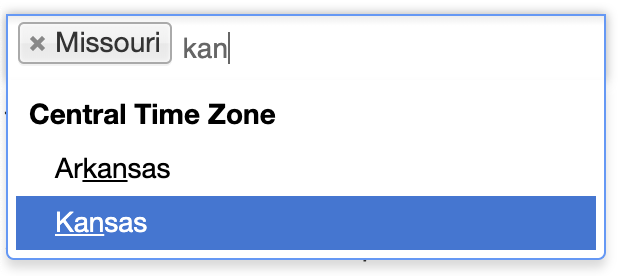
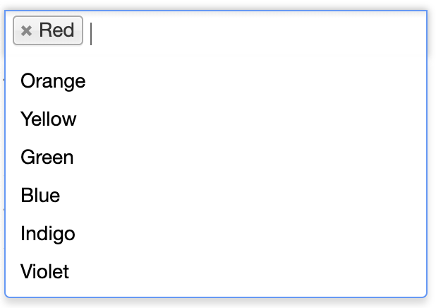
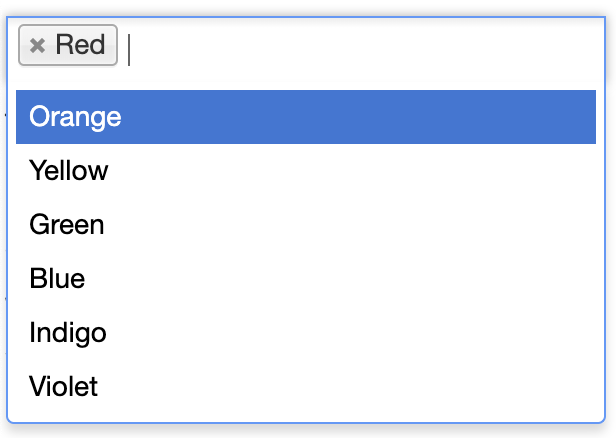
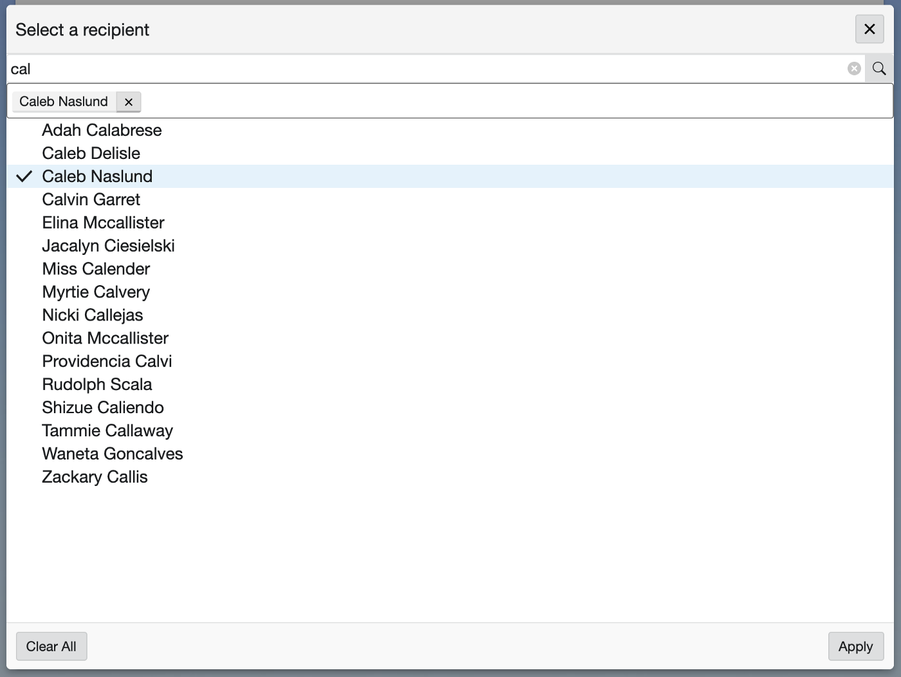

> This was originally posted on [Medium on June 7, 2019](https://medium.com/swlh/how-ios-voiceover-demonstrates-the-power-and-flexibility-of-react-5369679b6a6b)


<figcaption>
  React.js Logo
</figcaption>

I was recently blessed with the opportunity to work on an extremely
high-priority project which aimed to fix an accessibility bug in a multi-select
component. First I’ll discuss what we were dealing with and why it was an issue.
Then I’ll go into how we solved the underlying problem.

**TLDR**: iOS VoiceOver is the new IE 🙅‍♂️ and React is awesome 😎

Let's get started!

Let’s say there exists a legacy solution that is currently in production and is
in maintenance mode. This solution uses a tech stack that your company has moved
away from and you are not familiar with it at all. There’s a weird structure,
templates, and a bunch of code you don’t understand. All you know is is that
there’s an accessibility bug in a non-browser-native select/dropdown that is
rendered via some jQuery.

Okay, hypotheticals aside, this component is actually first rendered via a
Django template and then enhanced/decorated with an external dependency. The
component in question was actually using a
[popular JavaScript dropreadown library: Select2](https://select2.org/).



<figcaption>
  Select2 MultiSelect Example
</figcaption>

The problem is that Select2 doesn’t provide a good user experience for iOS
VoiceOver users. Why is this? Well, it all comes down to two things: Apple’s
heuristics for the iOS VoiceOver virtual indicator are notoriously bad, and
there’s not an accessibility API to access when you’re a web app (thanks
Apple 😒). But, putting the blame on Apple (while justified 😤) doesn’t fix the
problem that the client has identified. As an engineer, we’re supposed to fix
problems, so let’s fix it! Before we can fix it, we must understand the problem.

---

## Understanding the Problem 🤔

So how does the virtual indicator work? For the most part, it follows the normal
DOM structure and tabIndex ordering. In general, where the focus is is where the
virtual indicator is (except when it’s not!). Where it breaks down is when
something in the DOM is only a sibling visually. This is generally achieved by
rendering content outside of the normal DOM flow (e.g. at the end of the body)
and applying CSS transforms to make the new content appear alongside the sibling
content.

How could you get into this kind of situation? **Modals, popups, and
drop-downs**. For better or for worse (definitely for worse 🙃), our UX
department loves to build complex workflows with modals, popups, and drop-downs.
In all seriousness though, shoutout 🗣 to them for being a wonderful help in
guiding us through this problem 🙌.

Web-development is a type of engineering and with engineering comes trade-offs.
Select2 is not immune to this.

How does Select2 work? Well, here’s a simplified explanation. Let’s say you have
a multi-select workflow in a form and you have a list of data to select from
like:

```js
const data = ['Red', 'Orange', 'Yellow', 'Green', 'Blue', 'Indigo', 'Violet'];
```

<figcaption>
  Example list of colors
</figcaption>

Given this list, in a simplified world, when you render a Select2 multi-select
around a hidden input (used for your form submission), your screen will look
like:



<figcaption>
  Example Select2 rendering given the data list of colors above
</figcaption>

And your corresponding DOM may look like the following:

```html
<html>
  <body>
    <div class="content">
      <form>
        <label for="color">Select a color</label>
        <div class="select2-container select2-container-multi">
          <ul class="select2-choices">
            <li class="select2-search-choice">
              <!-- a selected choice here -->
              <div>Red</div>
            </li>
            <li class="select2-search-field">
              <!-- the Select2's input field -->
              <input type="text" class="select2-input" />
            </li>
            <!-- the hidden input that is decorated with Select2 that will be used in the form submission -->
            <input type="hidden" name="color" value="red" />
          </ul>
        </div>
        <button type="submit">Submit Form</button>
      </form>
    </div>
    <div class="select2-drop select2-drop-multi ...">
      <!-- this is the actual dropdown content, notice it's not a direct sibling of the Select2 itself -->
      <ul class="select2-results">
        <li class="select2-result">Red</li>
        <li class="select2-result">Orange</li>
        <li class="select2-result">Yellow</li>
        <li class="select2-result">Green</li>
        <li class="select2-result">Blue</li>
        <li class="select2-result">Indigo</li>
        <li class="select2-result">Violet</li>
      </ul>
    </div>
  </body>
</html>
```

<figcaption>
  DOM layout of a trivial Select2 Example
</figcaption>

Notice that the Select2 results aren’t a direct sibling of the Select2
container. This is the part that iOS VoiceOver trips up on.

Take another look at the screenshot of the Select2 dropdown above. How would you
expect the iOS VoiceOver virtual indicator to behave?

If you answered that the next navigation swipe lands on the dropdown options,
then you are sadly mistaken my friend 😢.
[WAT](https://www.destroyallsoftware.com/talks/wat). WAT indeed..



<figcaption>
  This is NOT what iOS VoiceOver navigates to next when focused on the input
</figcaption>

A keen eye will notice that there’s another focusable element between the
Select2 container div and the Select2 dropdown div: ***the submit button***. In
more complicated forms, you’ll have many different fields between your dropdown
and the submit button which will just exacerbate the problem.

What iOS VoiceOver actually does is navigates through ***the rest of the entire
DOM and THEN the dropdown options***. Yes, it’s THAT bad.

---

## Fixing What’s Broken With React 🛠

Now that we understand how we got here, how did we fix this with React (and the
native browser APIs)?

Remember how there was a hidden input in the example above? Well, we had one of
those generated from the Django template too. The specific hidden input we were
working with was given some handy
[data attributes](https://developer.mozilla.org/en-US/docs/Learn/HTML/Howto/Use_data_attributes)
which we were able to use to pass as props to a React tree. There were
attributes for things like a `placeholder`, `maxSelection` count, and a
`searchUrl` if the data was asynchronously fetched. There was also an attribute
we could use as a selector which would be one of two things: `data-dynamic-list`
or `data-dropdown-list`, the former being asynchronously loaded data and the
latter a typical static dropdown list.

One of the coolest things about React is that it’s so flexible. You can
incrementally
[add it to a website](https://reactjs.org/docs/add-react-to-a-website.html).
What makes this so cool is that as long as there’s a container, you can
[render React components inside it](https://reactjs.org/docs/rendering-elements.html#rendering-an-element-into-the-dom).
In our case, we have a container, which is the parent component of our hidden
inputs labeled with `data-dynamic-list` or `data-dropdown-list` attributes! All
we need is a little native browser API magic and we’ve got ‘em 🎯:

```js
import { dynamicList, dropdownList } from 'codys-cool-react-stuff';

// wait for Django to load and render everything before we try to decorate with our custom React components :)
window.addEventListener('load', () => {
  // get all the dynamic lists on the page
  document.querySelectorAll('[data-dynamic-list]').forEach((dynamicListElement) => {
    // render a new React tree with this specific dynamic list
    dynamicList(dynamicListElement);
  });

  // get all the dropdown lists on the page
  document.querySelectorAll('[data-dropdown-list]').forEach((dropdownListElement) => {
    // render a new React tree with this specific dropdown list
    dropdownList(dropdownListElement);
  });
});
```

<figcaption>
  Get all the dynamic and dropdown lists on the page
</figcaption>

Now that we have each of the lists on the page, we can replace them with a
container and render our custom React code inside them! Notice that this will
produce multiple React trees on the page if there are multiple dynamic and/or
dropdown lists 😉

Before we do that, we just need to extract the datasets from the list elements
and then we can pass those as props down to the React tree. This can be done as
simple as:

```js
const { dataset } = element;
const {
  isMultiple,
  placeholder,
  maxSelection,
  // etc,
} = dataset;
```

<figcaption>
  Extracting the container's metadata from its dataset
</figcaption>

And now, since we want full control of the tree and therefore the hidden input
or select that is used for form submission, we can replace it with our
container:

```js
export default function replaceNodeWithContainer(node) {
  const { parentElement } = node;

  const container = document.createElement('div');

  parentElement.replaceChild(container, node);

  return container;
}
```

<figcaption>
  Replace the given node with a React tree container
</figcaption>

Now all that’s left to do is put it all together and render our custom
component.

```js
import React from 'react';
import { render } from 'react-dom';
import getContainer from './utils/getContainer';
import SearchableSelection from './components/SearchableSelection';

export default function dynamicList(node) {
  const { name, id } = node;
  const dataset = { ...(node.dataset || {}) };
  const {
    placeholderText,
    maximumSelection,
    searchUrl,
    additionalQueryParams,
    isMultiple,
  } = dataset;

  const placeholder = placeholderText || undefined;
  const maxSelection = isMultiple ? parseInt(maximumSelection, 10) || undefined : 1;
  const container = getContainer(node);

  const props = {
    selectId: id,
    name,
    searchUrl,
    placeholder,
    isMultiple,
    maxSelection,
    additionalQueryParams,
    searchThreshold: 2,
  };

  const component = <SearchableSelection {...props} />;

  render(component, container);
}
```

<figcaption>
  Render Our Custom React Select2 Dynamic List Replacement
</figcaption>

With this full control, we can use the magic of
[refs](https://reactjs.org/docs/refs-and-the-dom.html) to manipulate the hidden
`input` and/or `select` nodes.


<figcaption>Noice!</figcaption>

---

## The Result: Drumroll Please.. 🥁

So, with all that work, what do we have to show for it? Well, I can’t show the
rest of the code (company secret 🤫😉). However, we now have a responsive and
accessible multi-select asynchronous dropdown!



<figcaption>
  Responsive and Accessible Asynchronous MultiSelect Dropdown
</figcaption>

We ended up responsively rendering a modal where the dropdown options are a
direct sibling of the search input. There are a few interesting gotchas that we
ran into, however.

Normally on the web, window size is sufficient for mobile device detection.
However, our clients frequently operate on iPads, which can be much larger than
the typical mobile screen size and appear as if it was a desktop device if we
only paid attention to the window width. So, we detect if we were at a mobile
breakpoint or if `'ontouchstart' in window` (better than User Agent string
parsing 🙌).

When we open the modal, the virtual indicator wasn’t initially moving to it.To
fix this, we used a ref to focus on the close button in the top right. We
initially tried to focus on the h1 title, but iOS VoiceOver really only likes it
when you programmatically change focus onto ***interactable elements***.
🎶_Easy like Sunday mornin’_ 🎶

The presence of both the `X` (close) and `Apply` buttons was an interesting
choice by UX. This implies that clicking on the `X` will cancel your changes,
while clicking on `Apply` will commit them. So, while the state of what was
selected in each dropdown was
[lifted up](https://reactjs.org/docs/lifting-state-up.html),
we needed to maintain a _local state_ within the modal component when it was
open. Only when we clicked submit would we commit (apply) our changes. So, we
initialized the local selections state with the _current state of the parent_
and then maintained local selection state as normal
([shameless plug for hooks 🎣](https://reactjs.org/docs/hooks-intro.html)).
We would pass the local selection state back to the parent through an `onApply`
callback when the user clicked the `Apply` button. Pretty neat 📸

```js
import React, { useState } from 'react';
import PropTypes from 'prop-types';

const propTypes = {
  // ..., other props
  onApply: PropTypes.func,
  selections: PropTypes.arrayOf(PropTypes.shape({
    id: PropTypes.string.isRequired,
    text: PropTypes.string.isRequired,
  })),
};

const defaultProps = {
  // ...,
  onApply: () => {},
  selections: [],
};

function Modal({ selections, ...otherProps }) {
  // initialize localSelections state with selections prop given :)
  const [localSelections, setLocalSelections] = useState(selections);

  function handleOnApply() {
    // pass the localSelections onto the parent component through
    // the onApply callback prop :D
    onApply(localSelections);
  }

  return (
    <div>
      {/* hidden stuff ;) */}
      <button type="button" onClick={handleOnApply}>Apply</button>
    </div>
  );
}

Modal.propTypes = propTypes;
Modal.defaultProps = defaultProps;

export default Modal;
```

<figcaption>
  Handling Local Modal State
</figcaption>

---

## In Conclusion 🎬

This project was definitely one of my favorites to work on so far. It has been
challenging and really rewarding. As engineers, it can sometimes seem that a
limitation in an OS or API prevents us from proceeding forward. Often times
though, this is simply an opportunity to flex our thinkin’ muscles and provide a
novel solution to a complex problem. In tackling this, I’ve definitely learned a
lot about the power of the browser APIs and React, as well as how hard it can be
to get accessibility right. I also want to thank the engineers that have helped
me along the way, as well as our UX department for providing us with visuals and
a different workflow on such short notice 🚀.

I was already a huge fan of React ⚛︎ before this, but it definitely solidifies my
appreciation for the framework. I hope you have learned something and have
enjoyed the read. Let me know what you thought in the comments below! ✌️
