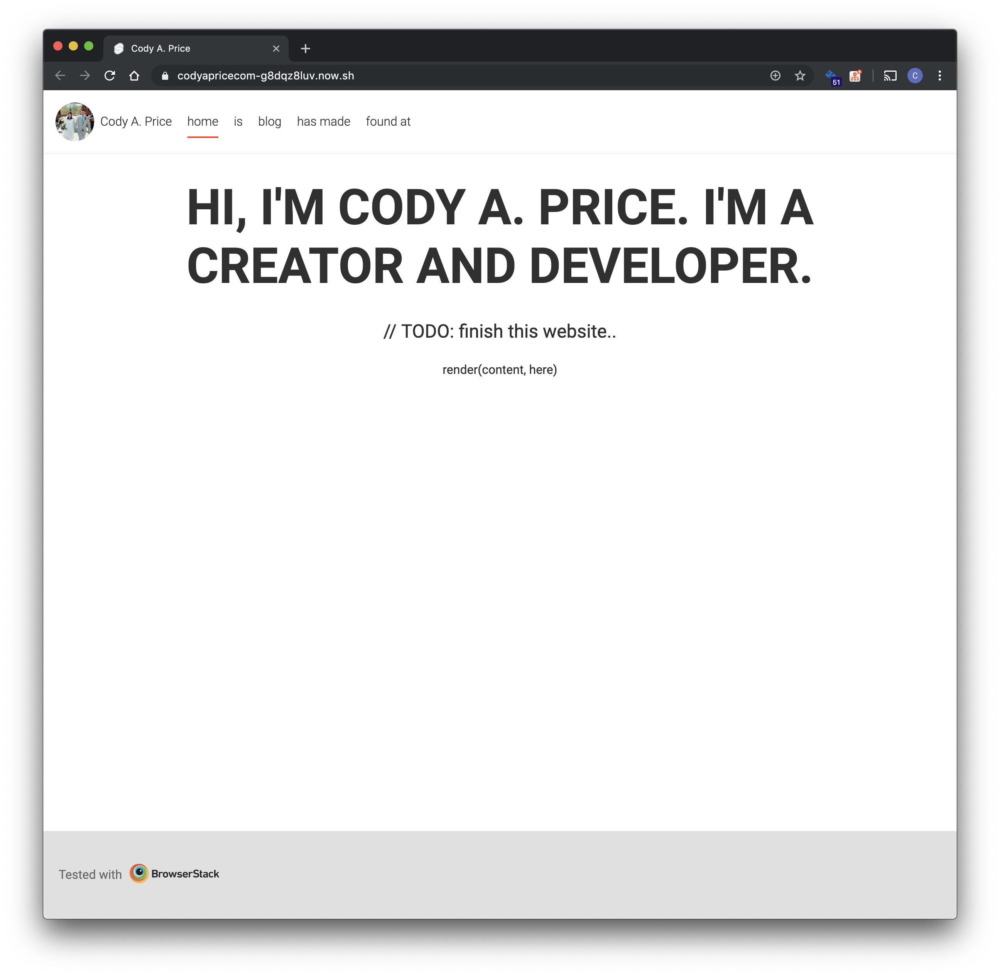

<figcaption>
  It'll never be "perfect" so just ship it now. 🚢
</figcaption>

---

I've always wanted to have my own lil' corner on the web. A spot to show off my
accomplishments and projects, share knowledge and insights, occasionally blog,
and house my portfolio. About two weeks ago, August 8th to be exact, I pulled the
trigger and bought my domain, [codyaprice.com](https://codyaprice.com), from
[Google Domains](https://domains.google.com). After that, I needed a way to
deploy it. I had heard great things about [zeit](https://zeit.co) and gave them
a shot (can't recommend them enough btw!). So, within fifteen minutes and twelve
dollars later, I had a domain and deployment/cdn service. Awesome!


<figcaption>
  I have a domain.. now what?
</figcaption>

## GET /framework

A few weeks before I got my itchy trigger finger, I found
[@Rich_Harris'](https://twitter.com/Rich_Harris) talk about
[rethinking reactivity](https://youtu.be/AdNJ3fydeao) and fell in love with
[svelte](https://svelte.dev). This is what a UI framework should be!

Don't get me wrong, I love React. I love how easy it is to create beautiful and
flexible interfaces with a declarative, straightforward approach. I love working
with ES2015+ JavaScript and it has somehow become the language I _think_ in. My
pseudocode is pretty much JS now. However, it's always bothered me that you have
to include _**the universe**_ with any React app, while
[reconciliation](https://reactjs.org/docs/reconciliation.html) and the virtual
DOM
[ain't free](https://medium.com/@hayavuk/why-virtual-dom-is-slower-2d9b964b4c9e).


<figcaption>
  Just give it another `rm -rf` for good measure.
</figcaption>

> React needs to figure out how to efficiently update the UI to match the most
> recent tree...[and] implements a heuristic `O(n)` algorithm.

The virtual DOM is
[pure overhead](https://svelte.dev/blog/virtual-dom-is-pure-overhead)!
Reconciliation is at least `O(n)` and runs on each render cycle. It's true
that, in general, React apps can consistently output 60 fps, but surely we can
do better than `O(n)` on top of what the browser already does and giant chunks
of JavaScript runtime right?

So back to svelte. What drew me to svelte was that it is component based, not
unlike React, and compiled to _just JavaScript_ without polluting your bundle
with production dependencies. It builds fast, ships fast, and runs fast. It's
got a beautiful API and is performant enough to run on
[embedded devices](https://twitter.com/sveltejs/status/1088500539640418304)!

That's incredible. I mean, I went to school for Electrical and Computer
Engineering and cut my programming teeth on C and microcontrollers. Before
becoming a full time web developer, I was an Embedded Systems Engineer working
on extremely (to today's consumer compute standards)
memory-and-power-constrained microprocessors (32kB and 32MHz 💃) that didn't
even have a heap: everything on the stack 📚, bb 😘. By definition, I'm a perf
nerd 🤓.

I was sold enough on svelte to use zeit's [sapper](https://sapper.svelte.dev/)
template. At least at first.

## Float Like a Rock, Sting Like a Fly

As I've said before, I basically live and breathe React. I write it M-F 9-5
[@cerner](https://twitter.com/cernereng). So, transitioning to svelte was slow.
Even though it's similar to React and has a similar development _mouthfeel_,
it's still _**different**_. There's a small learning curve and there's not
nearly as much community support (yet). This isn't svelte's fault, but it plays
a factor in how fast I can iterate on features and development for my website.

<https://twitter.com/veneficaultrix/status/1003039904346132481?s=20>

At the beginning of this post, I mentioned what I want my website to contain:
blog posts, tutorials and knowledge sharing, projects, portfolio, content, etc.
Blog posts are great to pad websites with when fresh. Generally, they're just
text and images. Simple content. Being that I write a lot of documentation in
markdown, I wanted to be able to write my posts in markdown and then have a
build time pipeline that renders them to markdown. I also wanted syntax
highlighting for code snippets, since a lot of what I have to share is
code-centric. So, I found
[prism](https://prismjs.com/)
for syntax highlighting and
[unified](https://unifiedjs.com/)
for markdown to html parsing and conversion (and so much more). Both of these
tools are incredible, but there isn't a first class solution or plugin for
sapper. And I fought with getting prism to work properly with svelte since
[css modules](https://github.com/css-modules/css-modules)
are a first class feature and on by default (one of the things I love about
svelte). I worked on this in my spare time for nearly two weeks without
producing nor hosting any meaningful content.



<figcaption>
  My website was dorment, vacant, and quite naked. 🙈
</figcaption>

I was getting kind of frustrated and felt like I wasn't moving fast enough. I
just wanted to start with my
[medium articles](https://medium.com/@dev.cprice)
and go from there. I needed some help and perhaps some guidance. When I woke up
yesterday around 6am, I opened twitter on my phone and at the top of my feed was
a [@ken_wheeler](https://twitter.com/ken_wheeler) tweet:

<https://twitter.com/ken_wheeler/status/1163760360693874688?s=20>

<figcaption class="tweet">
  Ken Wheeler spittin' facts: Best practice === ship it
</figcaption>

And that's when I decided I needed to move on from svelte and sapper.

## Great Gatsby

I can ship something that is _good enough_  now and iterate on it quickly. If I
use what I'm familiar with and make my content framework agnostic, I can produce
a working, non-naked website while leaving the future open for
[change](https://overreacted.io/optimized-for-change/).
So, making like Sony with Spiderman, I rebooted my website
[repo](https://github.com/dev-cprice/codyaprice.com/commit/e40a83626d199f0a91273572cbd52e93982362a5)
using the
[Gatsby starter blog](https://www.gatsbyjs.org/starters/gatsbyjs/gatsby-starter-blog/)
template. All it took was:

```shell
gatsby new codyaprice.com https://github.com/gatsbyjs/gatsby-starter-blog
```

and I was up and running 🏃‍♂️. Even though svelte is more
[performant than React](https://svelte.dev/blog/write-less-code),
my development agility suffered when using it. Gatsby may take significantly
longer at build time than svelte, but I had my first Medium article self-hosted
and deployed faster than I could with native sapper. That's extremely valuable.
And so far, there's no reason to complain. Now I'm freed up to focus on adding
features that matter, like
[post tags and categories](https://github.com/dev-cprice/codyaprice.com/issues/1),
[side/secondary navigation](https://github.com/dev-cprice/codyaprice.com/issues/2),
and other
[routes](https://github.com/dev-cprice/codyaprice.com/issues/3).

---

## Closing Remarks

It's best to deliver as quick and as often as possible. A boss of mine has this
cartoon pinned on his office door and I think it's a perfect metaphor for this:


<figcaption>
  Agile, but like this: 🛹➡️🚲️️➡️🏎
</figcaption>

In this scenario, you develop, ship, and demo to the client over and over
(iterate) until you arrive at what they want. The key is speed and you can't go
fast without the right support and tools. For me, that's React and Gatsby. For
now.

In one of Rich Harris' tweet
[threads](https://twitter.com/Rich_Harris/status/1120736046357131271?s=20)
about his rethinking reactivity talk, he explains the ideas behind what make
svelte so great. Dan Abramov
[replied](https://twitter.com/dan_abramov/status/1120771116312690688?s=20)
with some insights into what's to come with React + Suspense and the caveats/
nuances of his incredible and jaw-dropping
[jsconf Iceland talk](https://www.youtube.com/watch?v=nLF0n9SACd4).
Sounds like React, like JavaScript, will be a safe
[bet](http://brendaneich.github.io/ModernWeb.tw-2015/#74)
for the near future.

That being said, I believe that the direction svelte took is the future of web
development. In my spare time (lol 😂), I can revisit using svelte and sapper.
Maybe they'll have more support and features by then? Maybe then I'll have
enough time and experience to roll my own solutions that mimic what the Gatsby
starter blog gives you out of the box. 🤷‍♂️

I'm still working on my personal website, but it's deployed live now and it has
(some) content on it. I can quickly add more without fighting a learning curve
and that's the most important thing right now. Who knows, maybe React and
Gatsby will satisfy my needs for years to come? One thing's for sure, knowing
the JavaScript scene, there'll always be a new hot thing to try out. Today it's
svelte, tomorrow it's `${hotNewJavaScriptFramework}`. As long as I'm learning
and growing along the way, that's all I can ask for!

Thanks for reading! ✌️
