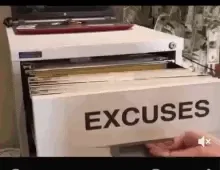

import Counter from "./Counter";

> Update: I have a working MDX configuration on a feature branch!
> Interactive examples are coming! 💪💪💪

<Counter />

Turns out good content takes a lot of time and effort. Who knew? 🤷‍♂️ 😂

<figcaption>Time for excuses... ⌚️ © Marius Mann @ pexels</figcaption>

**TLDR:** _It's coming...**soon**_

<figcaption>Soon... 🦉</figcaption>

So what's the deal? Why didn't the article drop at 11am local time?
_**It's Thursday after all**_.
Well, I feel that in order to explain some of the more complicated topics it requires either animated or interactive elements.
A lot of concepts related to the JavaScript event loop are much easier to explain when you have more than simple, static content.

## And that's what I want to provide.

<figcaption>Excuses, excuses... 😒</figcaption>

I want to have the ability to give you, the reader, an opportunity to really understand what is going on with each, transient step in the event loop workflow.
Things like describing a stack, queue, and what a specific function call did are much easier with dynamic content (animations and interactive content).

## How will you provide interactive content?

First off, I _could_ rip off some prior art as gifs, but that seems wrong.

> Good artists copy; Great artists steal
>
> Pablo Piscasso

Also, I'm rusty on my digital art, so making my own gifs or videos seems really time consuming.
Instead, I'll be making React components which I'll be able to embed directly into the article's page.
_And **you** will be able to play with them!_

## Neat, right?

Well, I think so! 🌝
And that's what's taking so long.
I have all the content I want to write.
I know what I want to say and how I want to say it.
However, I don't want you to get lost in the nuance of the details.

## It can and may get highly technical

And when it does, my weapon for clarity and against glazed over 👀 is _interactivity_.
I just need to make some website configuration changes to allow for embedding this kind of content.

So, while I may have missed the mark this week, it'll be ready next week.

## I promise. 🤞
